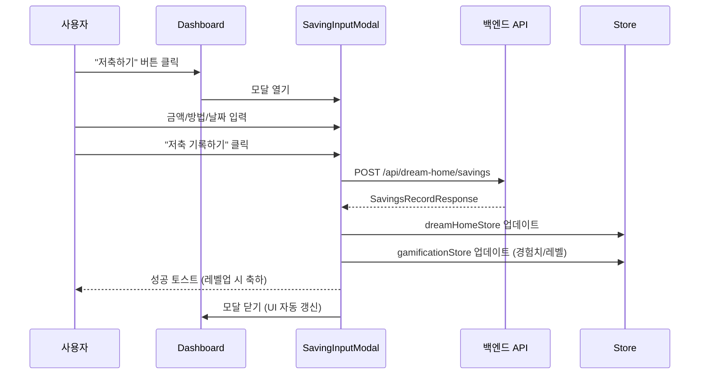
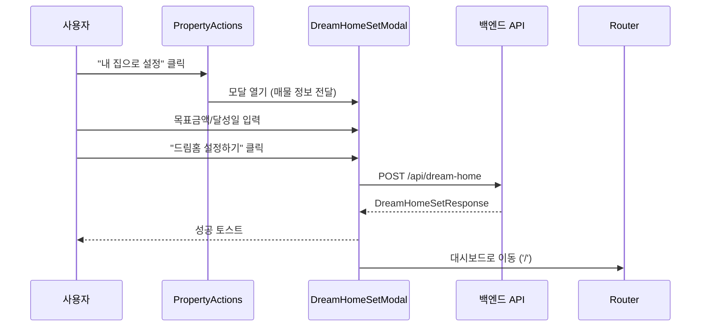

# 백엔드-프론트엔드 연동 구현 계획서 (v3)

> **작성일**: 2025-12-11  
> **v3 업데이트**: 리뷰 피드백 반영 (호출부 이관, 필드명 수정, 죽은 코드 정리 등)

---

## 0. 리뷰 피드백 반영사항

> [!IMPORTANT]
> 아래 5가지 피드백을 반영하여 계획을 수정했습니다.

### 0.1 기존 API 완전 폐기 및 전면 이관

| 기존 (프론트엔드) | 신규 (백엔드) | 조치 |
|------------------|---------------|------|
| `/users/dream-home` | `/dream-home` | **폐기** - 모든 호출부 이관 |
| `/users/dream-home/progress` | `/dream-home/savings` | **폐기** - 모든 호출부 이관 |
| `/users/saved-properties/*` | `/apartments/favorites` | **폐기** - 전면 이관 |

### 0.2 기존 메서드 → 신규 메서드 이관 맵

| 파일 | 기존 메서드 | 신규 메서드 | 호출부 |
|------|-------------|-------------|--------|
| `dreamHomeService.js` | `updateProgress()` | `recordSavings()` | `MainGoalCard.vue`, `SavingsView.vue` |
| `dreamHomeService.js` | `changeDreamHome()` | `setDreamHome()` | `PropertyActions.vue`, `dreamHomeStore.js` |
| `propertyService.js` | `toggleSaveProperty()` | `addFavorite()` / `deleteFavorite()` | `PropertyCard.vue`, `PropertyActions.vue` |
| `propertyService.js` | `getSavedPropertyIds()` | `getFavorites()` | `propertyStore.js` |

### 0.3 gamificationStore 필드명 수정

| 백엔드 응답 (`growth`) | 프론트엔드 필드 (`userGamification`) |
|----------------------|--------------------------------------|
| `growth.currentExp` | `experiencePoints` |
| `growth.level` | `currentLevel` |
| `growth.maxExp` | `nextLevelExp` |
| `growth.levelLabel` | `levelTitle` |

### 0.4 SavingInputModal 정리

- `saveType`: 항상 `DEPOSIT` (저축 전용 모달)
- `method`, `date` 필드: **UI에서 제거** (백엔드 미사용)
- `watch`, `levelUpResult`: **미사용 제거**

### 0.5 MainGoalCard 죽은 코드 정리

- `useGamificationStore` import: **유지** (경험치 정보 표시용)
- `XP_REWARD` 상수: **제거** (모달에서 처리)
- `handleSaving()` 함수: **제거** → `openSavingModal()`로 대체

---

## 1. 현황 분석 및 피드백 반영

### 1.1 사용자 피드백 요약

| 항목 | 피드백 내용 |
|------|-------------|
| **저축 기록** | Dashboard에서 "저축하기" 버튼 → 모달창 표시 → 저축 진행 → 경험치/레벨 반영 |
| **드림홈 설정** | 매물 선택 화면에서 "내 집으로 설정" → 모달창에서 목표 설정 |
| **관심 아파트** | 필터 버튼에서 "내 관심 아파트" 필터링 옵션으로 활용 |

### 1.2 현재 구현 상태

| 컴포넌트 | 현재 상태 | 문제점 |
|----------|-----------|--------|
| `MainGoalCard.vue` | 버튼 클릭 시 `dreamHomeStore.updateProgress()` 직접 호출 | 모달 없음, 백엔드 미연동 |
| `SavingInputModal.vue` | 폼 UI 구현됨 (`@submit` 이벤트) | 백엔드 API 호출 없음 |
| `PropertyActions.vue` | `dreamHomeStore.changeDreamHome()` 직접 호출 후 대시보드 이동 | 모달 없음, 백엔드 미연동 |
| 필터 시스템 | 가격/면적/지역 등 필터 존재 | "관심 아파트" 필터 없음 |

---

## 2. Proposed Changes

### Phase 1: 저축 기록 API 연동 (모달 기반)

#### 2.1.1 [MODIFY] `src/api/endpoints.js`

```javascript
/**
 * 드림홈(저축 목표) 관련 엔드포인트
 * 백엔드 /api/dream-home/* 엔드포인트
 */
export const DREAM_HOME_ENDPOINTS = {
    /** 드림홈 설정 (POST) */
    SET: '/dream-home',
    /** 저축 기록 (POST) */
    SAVINGS: '/dream-home/savings'
}
```

---

#### 2.1.2 [MODIFY] `src/api/services/dreamHomeService.js`

> [!WARNING]
> 기존 `updateProgress()` / `changeDreamHome()` 메서드를 **완전 제거**하고 새 메서드로 대체합니다.
> 모든 호출부 수정이 필수입니다.

```javascript
import apiClient from '@/api/client'
import { DREAM_HOME_ENDPOINTS } from '@/api/endpoints'

export const dreamHomeService = {
    /**
     * 드림홈 설정 (기존 changeDreamHome 대체)
     * 
     * @호출부: PropertyActions.vue, dreamHomeStore.js
     * @param {Object} data - { aptSeq, targetAmount, targetDate, monthlyGoal }
     * @returns {Promise<DreamHomeSetResponse>}
     */
    async setDreamHome(data) {
        const response = await apiClient.post(DREAM_HOME_ENDPOINTS.SET, data)
        return response.data.data
    },

    /**
     * 저축 기록 (기존 updateProgress 대체)
     * 
     * @호출부: MainGoalCard.vue, SavingsView.vue, dreamHomeStore.js
     * @param {Object} data - { amount, saveType: 'DEPOSIT'|'WITHDRAW', memo }
     * @returns {Promise<SavingsRecordResponse>}
     */
    async recordSavings(data) {
        const response = await apiClient.post(DREAM_HOME_ENDPOINTS.SAVINGS, data)
        return response.data.data
    }
    
    // ❌ 제거되는 메서드:
    // - updateProgress() → recordSavings()로 대체
    // - changeDreamHome() → setDreamHome()로 대체
}
```

---

#### 2.1.3 [MODIFY] `src/stores/dreamHomeStore.js`

`recordSavings` 액션 추가/수정:

```javascript
/**
 * 저축 기록 (백엔드 연동)
 * 
 * @param {number} amount - 저축 금액
 * @param {'DEPOSIT'|'WITHDRAW'} saveType - 저축 유형
 * @param {string} [memo=''] - 메모
 * @returns {Promise<SavingsRecordResponse>}
 */
async function recordSavings(amount, saveType = 'DEPOSIT', memo = '') {
    isLoading.value = true
    error.value = null

    try {
        const response = await dreamHomeService.recordSavings({
            amount,
            saveType,
            memo
        })

        // 드림홈 상태 업데이트
        if (response.dreamHomeStatus) {
            authStore.updateUserData({
                dreamHome: {
                    ...authStore.userDreamHome,
                    currentAmount: response.dreamHomeStatus.currentSavedAmount,
                    targetAmount: response.dreamHomeStatus.targetAmount,
                    achievementRate: response.dreamHomeStatus.achievementRate
                }
            })
        }

        return response
    } catch (err) {
        error.value = err.message || '저축 기록에 실패했습니다.'
        throw err
    } finally {
        isLoading.value = false
    }
}
```

---

#### 2.1.4 [MODIFY] `src/components/modals/SavingInputModal.vue`

> [!CAUTION]
> 기존 `method`, `date` 필드는 백엔드에서 사용하지 않으므로 **UI에서 제거**합니다.
> `watch`, `levelUpResult` 등 미사용 변수는 린트 워닝 방지를 위해 제거합니다.

**Template 변경 (미사용 필드 제거):**
```diff
-<!-- Saving Method -->
-<div class="form-group">
-  <label for="method" class="form-label">저축 방법</label>
-  <select id="method" v-model="formData.method" class="form-select" required>
-    ...
-  </select>
-</div>
-
-<!-- Date Input -->
-<div class="form-group">
-  <label for="date" class="form-label">저축 날짜</label>
-  <input id="date" v-model="formData.date" type="date" ... />
-</div>
```

**Script 변경:**
```diff
 <script setup>
-import { ref, computed } from 'vue'
+import { ref, computed } from 'vue'  // watch 제거
 import { PhX } from '@phosphor-icons/vue'
+import { useDreamHomeStore } from '@/stores/dreamHomeStore'
+import { useGamificationStore } from '@/stores/gamificationStore'
+import { useToast } from '@/composables/useToast'

+const dreamHomeStore = useDreamHomeStore()
+const gamificationStore = useGamificationStore()
+const { showSuccess, showError } = useToast()

+const isSubmitting = ref(false)
+// ❌ levelUpResult 제거 (미사용)

 // 폼 데이터 간소화
 const formData = ref({
   amount: null,
-  method: '',
-  date: new Date().toISOString().split('T')[0],
   memo: ''
 })

 const handleSubmit = async () => {
   if (!formData.value.amount || formData.value.amount <= 0) {
     showError('금액을 입력해주세요')
     return
   }

   isSubmitting.value = true
   
   try {
     // 백엔드 저축 API 호출 (항상 DEPOSIT)
     const result = await dreamHomeStore.recordSavings(
       formData.value.amount,
       'DEPOSIT',
       formData.value.memo || ''
     )
     
     // 경험치/레벨 반영
     if (result.growth) {
       gamificationStore.applyGrowthResult(result.growth)
       
       if (result.growth.isLevelUp) {
         showSuccess(`🎉 레벨업! ${result.growth.levelLabel}`)
       } else {
         showSuccess(`+${result.growth.expChange} XP 획득!`)
       }
     }
     
     emit('submit', result)
     closeModal()
   } catch (error) {
     showError(error.message || '저축 기록에 실패했습니다')
   } finally {
     isSubmitting.value = false
   }
 }
 </script>
```

---

#### 2.1.5 [MODIFY] `src/components/dashboard/bento/MainGoalCard.vue`

> [!NOTE]
> 경험치 처리는 **모달(SavingInputModal)**에서 담당합니다.
> 죽은 코드(`XP_REWARD`, `handleSaving`, `contributionAmount`)를 정리합니다.

```diff
 <template>
   <div class="bento-card main-goal-card">
     <!-- ... existing template ... -->
     
     <!-- Full-Width Button -->
-    <button class="savings-button" @click="handleSaving">
+    <button class="savings-button" @click="openSavingModal">
       <span class="btn-text">저축하기</span>
     </button>
+    
+    <!-- Saving Modal -->
+    <SavingInputModal
+      :is-open="showSavingModal"
+      @close="closeSavingModal"
+      @submit="handleSavingComplete"
+    />
   </div>
 </template>

 <script setup>
-import { computed } from 'vue'
+import { ref } from 'vue'
 import { storeToRefs } from 'pinia'
 import { useDreamHomeStore } from '../../../stores/dreamHomeStore'
-import { useGamificationStore } from '../../../stores/gamificationStore'
-import { formatNumber } from '../../../utils/formatters'
-import AppIcon from '../../common/AppIcon.vue'
+import { formatNumber } from '../../../utils/formatters'  // 유지 (UI 표시용)
+import SavingInputModal from '../../modals/SavingInputModal.vue'

 const dreamHomeStore = useDreamHomeStore()
 const {
   currentAmount,
   targetAmount,
   propertyName,
   achievementRate,
-  remainingAmount,
-  monthlyGoal
+  remainingAmount
 } = storeToRefs(dreamHomeStore)
-const gamificationStore = useGamificationStore()
-const { remainingExp } = storeToRefs(gamificationStore)

-// ❌ 제거: contributionAmount (모달에서 처리)
-// ❌ 제거: XP_REWARD (모달에서 처리)
-// ❌ 제거: handleSaving (openSavingModal로 대체)

+// 모달 상태
+const showSavingModal = ref(false)

+const openSavingModal = () => {
+  showSavingModal.value = true
+}

+const closeSavingModal = () => {
+  showSavingModal.value = false
+}

+const handleSavingComplete = (result) => {
+  // UI는 store reactive 데이터로 자동 갱신됨
+  console.log('저축 완료:', result)
+}
 </script>
```

---

#### 2.1.6 [MODIFY] `src/stores/gamificationStore.js`

> [!IMPORTANT]
> 백엔드 응답 필드명과 프론트엔드 스토어 필드명이 다릅니다.
> 매핑: `growth.level` → `currentLevel`, `growth.currentExp` → `experiencePoints`

```javascript
/**
 * 성장 결과 반영 (저축 API 응답에서 사용)
 * 
 * 백엔드 SavingsRecordResponse.GrowthResult 필드:
 * - resultType: 'SUCCESS' | 'LEVEL_UP'
 * - expChange: 획득 경험치
 * - currentExp: 현재 총 경험치
 * - maxExp: 다음 레벨까지 필요 경험치
 * - level: 현재 레벨
 * - isLevelUp: 레벨업 여부
 * - levelLabel: 레벨 타이틀 (예: "2층 골조 공사")
 * 
 * @param {Object} growth - SavingsRecordResponse.growth
 */
function applyGrowthResult(growth) {
    if (!growth) return
    
    authStore.updateUserData({
        gamification: {
            ...authStore.userGamification,
            // 필드명 매핑 (백엔드 → 프론트엔드)
            experiencePoints: growth.currentExp,  // currentExp → experiencePoints
            currentLevel: growth.level,           // level → currentLevel
            nextLevelExp: growth.maxExp,          // maxExp → nextLevelExp
            levelTitle: growth.levelLabel         // levelLabel → levelTitle
        }
    })
}
```

---

### Phase 2: 드림홈 설정 모달

#### 2.2.1 [NEW] `src/components/modals/DreamHomeSetModal.vue`

매물 선택 후 목표 설정 모달:

**기능:**
- 선택한 매물 정보 표시 (아파트명, 위치, 최신 실거래가)
- 목표 금액 입력 (계약금 기준 자동 계산 제공)
- 목표 달성일 선택 (datepicker)
- 월 목표 저축액 자동 계산 (목표금액 ÷ 남은 개월수)
- **백엔드 API 호출**: `POST /api/dream-home`

**Template:**
```vue
<template>
  <transition name="modal">
    <div v-if="isOpen" class="modal-overlay" @click="handleOverlayClick">
      <div class="modal-container" @click.stop>
        <!-- Header -->
        <div class="modal-header">
          <h2 class="modal-title">🏠 드림홈 설정</h2>
          <button class="close-button" @click="closeModal">✕</button>
        </div>

        <!-- Property Info -->
        <div class="property-info">
          <h3>{{ property.title }}</h3>
          <p>{{ property.sido }} {{ property.sigungu }}</p>
          <p class="price">최신 거래가: {{ formatPrice(property.price) }}</p>
        </div>

        <!-- Form -->
        <form @submit.prevent="handleSubmit">
          <!-- Target Amount -->
          <div class="form-group">
            <label>목표 금액 (필요 계약금)</label>
            <div class="input-with-calc">
              <input v-model.number="formData.targetAmount" type="number" />
              <button type="button" @click="calcDownPayment">30% 자동계산</button>
            </div>
          </div>

          <!-- Target Date -->
          <div class="form-group">
            <label>목표 달성일</label>
            <input v-model="formData.targetDate" type="date" :min="minDate" />
          </div>

          <!-- Monthly Goal (Auto-calculated) -->
          <div class="form-group">
            <label>월 목표 저축액</label>
            <input v-model.number="formData.monthlyGoal" type="number" />
            <p class="hint">{{ monthsRemaining }}개월 동안 매달 {{ formatPrice(suggestedMonthly) }}씩</p>
          </div>

          <!-- Submit -->
          <button type="submit" :disabled="isSubmitting">
            {{ isSubmitting ? '설정 중...' : '드림홈 설정하기' }}
          </button>
        </form>
      </div>
    </div>
  </transition>
</template>
```

**Script 핵심:**
```javascript
async function handleSubmit() {
  isSubmitting.value = true
  
  try {
    const response = await dreamHomeService.setDreamHome({
      aptSeq: props.property.aptSeq || props.property.id,
      targetAmount: formData.value.targetAmount,
      targetDate: formData.value.targetDate,
      monthlyGoal: formData.value.monthlyGoal
    })
    
    // authStore 업데이트
    authStore.updateUserData({
      dreamHome: response.dreamHome
    })
    
    showSuccess(`"${props.property.title}"을(를) 드림홈으로 설정했습니다!`)
    emit('success', response)
    closeModal()
    
    // 대시보드로 이동
    router.push('/')
  } catch (error) {
    showError(error.message || '드림홈 설정에 실패했습니다')
  } finally {
    isSubmitting.value = false
  }
}
```

---

#### 2.2.2 [MODIFY] `src/components/property/detail/PropertyActions.vue`

모달 기반으로 변경:

```diff
 <template>
   <div class="property-actions">
     <!-- ... existing buttons ... -->
     
     <button
       @click="handleSetAsDreamHome"
       class="action-btn dream-home-btn"
     >
       🏠 내 집으로 설정
     </button>
+    
+    <!-- Dream Home Set Modal -->
+    <DreamHomeSetModal
+      :is-open="showDreamHomeModal"
+      :property="property"
+      @close="closeDreamHomeModal"
+      @success="handleDreamHomeSet"
+    />
   </div>
 </template>

 <script setup>
+import { ref } from 'vue'
+import DreamHomeSetModal from '@/components/modals/DreamHomeSetModal.vue'

+const showDreamHomeModal = ref(false)

 function handleSetAsDreamHome() {
-  dreamHomeStore.changeDreamHome({ ... })
-  showSuccess(...)
-  setTimeout(() => router.push('/'), 1000)
+  showDreamHomeModal.value = true
 }

+function closeDreamHomeModal() {
+  showDreamHomeModal.value = false
+}

+function handleDreamHomeSet(response) {
+  // 성공 처리 (모달에서 이미 처리)
+}
 </script>
```

---

### Phase 3: 관심 아파트 필터

#### 2.3.1 [MODIFY] `src/api/endpoints.js`

```diff
 export const PROPERTY_ENDPOINTS = {
     LIST: '/apartments',
     DETAIL: (id) => `/apartments/${id}`,
-    REGION_COORDINATES: (regionName) => `/apartments/regions/${encodeURIComponent(regionName)}/coordinates`
+    REGION_COORDINATES: (regionName) => `/apartments/regions/${encodeURIComponent(regionName)}/coordinates`,
+    /** 관심 아파트 관리 */
+    FAVORITES: '/apartments/favorites',
+    FAVORITE_DELETE: (id) => `/apartments/favorites/${id}`
 }
```

---

#### 2.3.2 [MODIFY] `src/api/services/propertyService.js`

백엔드 관심 아파트 API 연동:

```javascript
/**
 * 관심 아파트 목록 조회
 * @returns {Promise<FavoriteResponse[]>}
 */
async getFavorites() {
    const response = await apiClient.get(PROPERTY_ENDPOINTS.FAVORITES)
    return response.data.data || []
},

/**
 * 관심 아파트 등록
 * @param {string} aptSeq - 아파트 고유 ID
 * @returns {Promise<FavoriteResponse>}
 */
async addFavorite(aptSeq) {
    const response = await apiClient.post(PROPERTY_ENDPOINTS.FAVORITES, { aptSeq })
    return response.data.data
},

/**
 * 관심 아파트 삭제
 * @param {number} favoriteId - 관심 아파트 ID
 */
async deleteFavorite(favoriteId) {
    await apiClient.delete(PROPERTY_ENDPOINTS.FAVORITE_DELETE(favoriteId))
},
```

---

#### 2.3.3 [MODIFY] `src/stores/propertyStore.js`

> [!WARNING]
> 기존 `/users/saved-properties` 기반 `savedPropertyIds`를 완전히 제거하고,
> 새 `/apartments/favorites` 기반 `favorites` 배열로 전면 이관합니다.
> `favoriteId`를 저장하여 삭제 시 사용합니다.

```diff
 // State
-const savedPropertyIds = ref([])  // ❌ 제거
+const favorites = ref([])  // FavoriteResponse 배열: [{id, aptSeq, apartmentInfo...}]
+
+// Computed: aptSeq 목록 (필터링용)
+const favoriteAptSeqs = computed(() => favorites.value.map(f => f.aptSeq))

 const filters = ref({
     propertyType: null,
     transactionType: null,
     priceMin: null,
     priceMax: null,
     areaMin: null,
     areaMax: null,
     sigungu: null,
     rooms: null,
     bathrooms: null,
     features: [],
     keyword: '',
+    favoritesOnly: false
 })

 const filteredProperties = computed(() => {
     let result = [...properties.value]

+    // 관심 아파트 필터 (favoriteAptSeqs 사용)
+    if (filters.value.favoritesOnly) {
+        result = result.filter(p => favoriteAptSeqs.value.includes(p.aptSeq))
+    }

     // ... existing filters ...
 })

-// ❌ 제거: fetchSavedPropertyIds()
-// ❌ 제거: toggleSaveProperty()

+/**
+ * 관심 아파트 목록 조회 (백엔드 연동)
+ */
+async function fetchFavorites() {
+    const authStore = useAuthStore()
+    if (!authStore.isAuthenticated) return
+
+    try {
+        const response = await propertyService.getFavorites()
+        favorites.value = response  // [{id, aptSeq, ...}]
+    } catch (err) {
+        console.error('Failed to fetch favorites:', err)
+    }
+}

+/**
+ * 관심 아파트 토글 (추가/삭제)
+ * @param {string} aptSeq - 아파트 고유 ID
+ */
+async function toggleFavorite(aptSeq) {
+    const existing = favorites.value.find(f => f.aptSeq === aptSeq)
+    
+    try {
+        if (existing) {
+            // 삭제 (favoriteId 사용)
+            await propertyService.deleteFavorite(existing.id)
+            favorites.value = favorites.value.filter(f => f.id !== existing.id)
+            return false  // 저장 해제됨
+        } else {
+            // 추가
+            const newFav = await propertyService.addFavorite(aptSeq)
+            favorites.value.push(newFav)
+            return true  // 저장됨
+        }
+    } catch (err) {
+        console.error('Failed to toggle favorite:', err)
+        throw err
+    }
+}

+/**
+ * 관심 아파트 필터 토글
+ */
+function toggleFavoritesFilter() {
+    filters.value.favoritesOnly = !filters.value.favoritesOnly
+}

+/**
+ * 특정 아파트가 관심 목록에 있는지 확인
+ * @param {string} aptSeq
+ */
+function isFavorite(aptSeq) {
+    return favoriteAptSeqs.value.includes(aptSeq)
+}
```

---

#### 2.3.4 [MODIFY] 필터 UI 컴포넌트

필터 패널에 "내 관심 아파트" 필터 추가:

```vue
<!-- FilterPanel.vue 또는 PropertyFilters.vue -->
<div class="filter-group">
  <label class="checkbox-label">
    <input
      type="checkbox"
      v-model="filters.favoritesOnly"
      @change="propertyStore.toggleFavoritesFilter()"
    />
    <span>❤️ 내 관심 아파트만</span>
  </label>
</div>
```

---

## 3. 파일 변경 요약

| 우선순위 | 파일 | 변경 유형 | 설명 |
|----------|------|-----------|------|
| **P1** | `endpoints.js` | MODIFY | `DREAM_HOME_ENDPOINTS` 추가 |
| **P1** | `dreamHomeService.js` | MODIFY | `setDreamHome`, `recordSavings` 구현 |
| **P1** | `dreamHomeStore.js` | MODIFY | `recordSavings` 백엔드 연동 |
| **P1** | `SavingInputModal.vue` | MODIFY | 백엔드 연동, 경험치/레벨 반영 |
| **P1** | `MainGoalCard.vue` | MODIFY | 모달 기반 저축으로 변경 |
| **P1** | `gamificationStore.js` | MODIFY | `applyGrowthResult` 추가 |
| **P2** | `DreamHomeSetModal.vue` | **NEW** | 드림홈 설정 모달 신규 |
| **P2** | `PropertyActions.vue` | MODIFY | 모달 기반 드림홈 설정 |
| **P3** | `propertyService.js` | MODIFY | 관심 아파트 API 연동 |
| **P3** | `propertyStore.js` | MODIFY | `favoritesOnly` 필터 추가 |
| **P3** | 필터 UI 컴포넌트 | MODIFY | "내 관심 아파트" 필터 UI |

---

## 4. UI/UX 플로우

### 4.1 저축하기 플로우



### 4.2 드림홈 설정 플로우



---

## 5. Verification Plan

### 5.1 테스트 시나리오

**Phase 1: 저축 기록**
1. Dashboard → "저축하기" 버튼 → 모달 표시
2. 금액 입력 → "저축 기록하기"
3. Network 탭: `POST /api/dream-home/savings` 확인
4. 성공 시: 드림홈 저축액 업데이트, 경험치 증가, (레벨업 시) 축하 메시지

**Phase 2: 드림홈 설정**
1. 매물 상세 → "내 집으로 설정" → 모달 표시
2. 목표금액/달성일 입력 → "드림홈 설정하기"
3. Network 탭: `POST /api/dream-home` 확인
4. 성공 시: 대시보드로 이동, 드림홈 정보 반영

**Phase 3: 관심 아파트 필터**
1. 매물 목록 → 필터 버튼 → "내 관심 아파트" 체크
2. 목록이 관심 아파트만 표시되는지 확인

---

## 6. 예상 타임라인

| 단계 | 예상 소요 |
|------|----------|
| Phase 1: 저축 API 연동 + 모달 수정 | 2-3시간 |
| Phase 2: 드림홈 설정 모달 신규 개발 | 2-3시간 |
| Phase 3: 관심 아파트 필터 | 1시간 |
| 테스트 및 디버깅 | 1시간 |
| **총계** | **6-8시간** |
