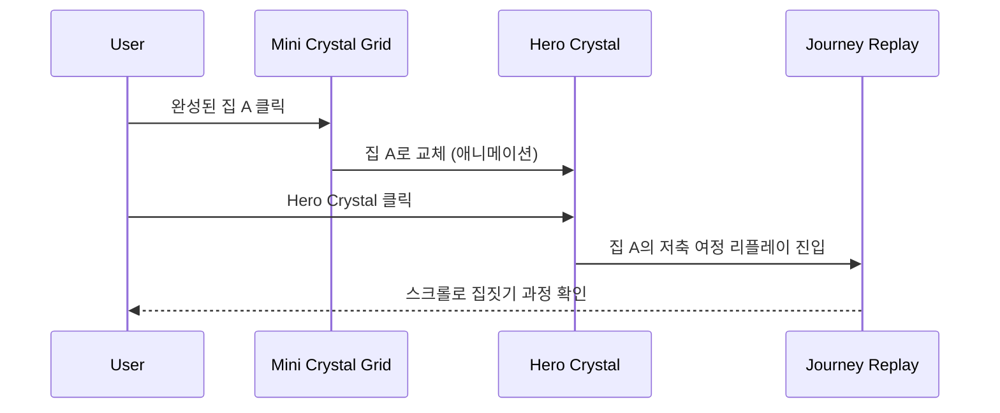

# Collection Feature PRD (Product Requirements Document)

> **작성일**: 2025-12-19  
> **상태**: 초안  
> **버전**: 1.0

---

## 1. 개요

Collection(컬렉션) 화면은 사용자가 **저축 여정을 통해 만들어온 집들을 전시하고 추억하는 공간**입니다. 마치 스노우볼 컬렉션처럼, 각각의 집은 유리 구슬(Crystal Ball) 안에 담겨 보관됩니다.

### 1.1 핵심 메타포

- **Memory Globe (기억의 구슬)**: 저축 여정의 결과물이 영롱한 유리 구슬 안에 보존됨
- **Time-Lapse Replay**: 구슬을 클릭하면 집이 지어지는 과정을 스크롤로 되감아 볼 수 있음

---

## 2. 화면 구조

```
┌─────────────────────────────────────────────┐
│              Collection View                 │
├─────────────────────────────────────────────┤
│                                             │
│         ┌───────────────────┐               │
│         │                   │               │
│         │   Hero Crystal    │  ◀── 현재 짓고 있는 집    │
│         │   (Main Viewer)   │      또는 선택된 완성 집   │
│         │                   │               │
│         └───────────────────┘               │
│              "서울 강남 오피스텔"              │
│                                             │
├─────────────────────────────────────────────┤
│           저장된 컬렉션 (Shelf)               │
│   ┌───┐  ┌───┐  ┌───┐  ┌───┐  ┌───┐        │
│   │ 🔮 │  │ 🔮 │  │ 🔮 │  │ 🔮 │  │ 🔮 │        │
│   └───┘  └───┘  └───┘  └───┘  └───┘        │
│   예전에 완성한 집들의 미니 크리스탈            │
└─────────────────────────────────────────────┘
```

---

## 3. 기능 상세

### 3.1 Hero Crystal Section (메인 뷰어)

| 항목 | 설명 |
|------|------|
| **목적** | 현재 짓고 있는 집 또는 선택된 완성 집을 크게 표시 |
| **기본 상태** | 진행 중인 드림홈이 있으면 해당 집 표시, 없으면 최근 완성된 집 표시 |
| **인터랙션** | 클릭 시 → Journey Replay 화면으로 이동 |

#### 3.1.1 Journey Replay (저축 여정 리플레이)

Hero Crystal을 클릭하면 진입하는 **스크롤 기반 타임랩스** 화면:

```
스크롤 위치:  0% ─────────────────────────── 100%
             │                               │
             ▼                               ▼
          [공터]  →  [기초]  →  [골조]  →  [완성]
           Phase 1    Phase 3    Phase 7    Phase 11
```

- **완성된 집**: 1단계(공터)부터 11단계(완성)까지 전체 스크롤 가능
- **진행 중인 집**: 현재 도달한 단계까지만 스크롤 가능 (이후 단계는 잠금 표시)

---

### 3.2 Mini Crystal Section (컬렉션 선반)

| 항목 | 설명 |
|------|------|
| **목적** | 과거에 완성한 집들을 미니 크리스탈로 진열 |
| **레이아웃** | 3열 그리드 (반응형: 모바일 1열, 태블릿 2열) |
| **인터랙션** | 미니 크리스탈 클릭 → Hero Crystal이 해당 집으로 교체 |

#### 3.2.1 선택 및 전환 플로우



---

### 3.3 Journey Replay 상세

#### 3.3.1 단계 구조 (11 Phases)

| Phase | 건축 단계 | 설명 |
|-------|----------|------|
| 1 | 공터 | 빈 땅, 시작 |
| 2 | 터파기 | 기초 공사 시작 |
| 3 | 기초 | 콘크리트 기초 |
| 4 | 골조 | 뼈대 |
| 5 | 외벽 | 벽 마감 |
| 6 | 지붕 | 지붕 설치 |
| 7 | 창문/문 | 개구부 설치 |
| 8 | 내부마감 | 바닥/벽지 |
| 9 | 기본가구 | 필수 가구 |
| 10 | 가전 | 가전제품 |
| 11 | 데코레이션 | 최종 장식, 완성 |

#### 3.3.2 스크롤 동작

```javascript
// 스크롤 비율에 따른 Phase 계산
const scrollRatio = scrollTop / maxScroll  // 0.0 ~ 1.0
const currentPhase = Math.ceil(scrollRatio * totalPhases)
```

#### 3.3.3 진행 중인 집의 잠금 처리

- 도달하지 않은 Phase는 **잠금 아이콘 + 반투명** 처리
- 스크롤이 현재 Phase를 초과하지 않도록 **clamp** 처리

---

## 4. 데이터 구조

### 4.1 Collection API 응답 스키마

```json
{
  "collections": [
    {
      "collectionId": 101,
      "dreamHomeId": 15,
      "themeCode": "CLASSIC",
      "propertyName": "강남 오피스텔",
      "location": "서울 강남구",
      "completedAt": "2025-10-15",
      "totalPhases": 11,
      "thumbnailUrl": "https://..."
    }
  ],
  "activeGoalExists": true,
  "inProgress": {
    "dreamHomeId": 20,
    "themeCode": "MODERN",
    "currentPhase": 4,
    "totalPhases": 11,
    "propertyName": "해운대 아파트",
    "location": "부산 해운대구"
  }
}
```

### 4.2 Journey Replay API 응답 스키마

```json
{
  "journeyId": 101,
  "dreamHomeId": 15,
  "themeCode": "CLASSIC",
  "totalPhases": 11,
  "maxUnlockedPhase": 11,
  "phases": [
    {
      "phase": 1,
      "name": "공터",
      "reachedAt": "2025-01-01",
      "savedAmount": 0
    },
    {
      "phase": 2,
      "name": "터파기",
      "reachedAt": "2025-02-15",
      "savedAmount": 500000
    }
    // ... 11 phases
  ]
}
```

---

## 5. 주요 인터랙션 시나리오

### 5.1 시나리오 A: 진행 중인 집 확인

1. 사용자가 Collection 화면 진입
2. Hero Crystal에 현재 짓고 있는 집이 표시됨
3. Hero Crystal 클릭
4. Journey Replay 화면으로 이동
5. 스크롤하여 공터(Phase 1)부터 현재 단계까지 확인
6. 현재 단계 이후는 잠금 표시로 진행 불가

### 5.2 시나리오 B: 완성된 집 회상

1. 사용자가 Collection 화면 진입
2. 하단 Mini Crystal Grid에서 예전 완성한 집 클릭
3. Hero Crystal이 해당 집으로 교체됨 (스왑 애니메이션)
4. Hero Crystal 클릭하여 Journey Replay 진입
5. 전체 11단계를 자유롭게 스크롤하며 추억 감상

---

## 6. 비기능 요구사항

### 6.1 성능

- Crystal Ball 이미지 Lazy Loading
- 테마별 이미지 Prefetch (Day/Night 모드)

### 6.2 접근성

- 키보드 네비게이션 지원 (Tab, Enter, Space)
- ARIA 레이블 제공
- 고대비 모드 지원

### 6.3 반응형

| 화면 크기 | 그리드 열 수 | Hero Crystal 크기 |
|----------|-------------|------------------|
| Desktop (>767px) | 3열 | 350px |
| Tablet (480-767px) | 2열 | 300px |
| Mobile (<480px) | 1열 | 280px |

---

## 7. 관련 문서

- [화면설계.md](./화면설계.md) - Section 8. 컬렉션
- [COLLECTION_INPROGRESS_IMPROVEMENT_PLAN.md](./COLLECTION_INPROGRESS_IMPROVEMENT_PLAN.md) - 진행 중 목표 개선 계획
- [goal-gamification-policy-v1.md](./goal-gamification-policy-v1.md) - 게이미피케이션 정책
