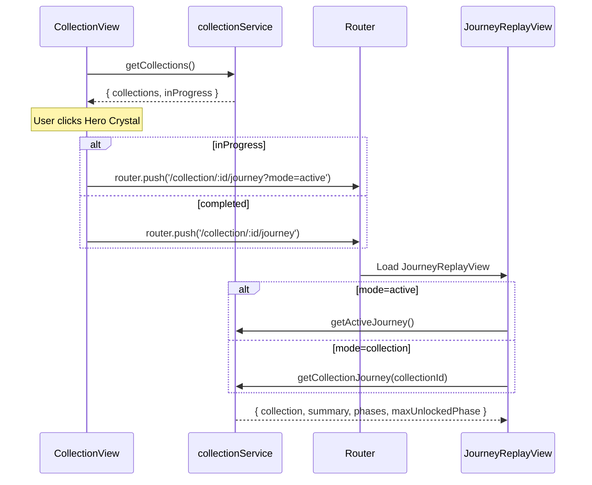

# Collection Feature Implementation Plan (v2)

> **작성일**: 2025-12-19  
> **기준 문서**: [COLLECTION_FEATURE_PRD.md](./COLLECTION_FEATURE_PRD.md)  
> **상태**: 리뷰 대기 (디자인 개선 추가)

---

## 1. 개요 및 목표

Collection 화면의 **기능 흐름**을 완성하고, **JourneyReplayView 디자인을 대시보드와 통일**합니다.

### 핵심 목표

1. **기능 연결**: Hero Crystal 클릭 → Journey Replay → 스크롤 애니메이션
2. **디자인 통일**: JourneyReplayView가 대시보드와 일관된 디자인 시스템 사용
3. **라우팅 일원화**: `/collection/:id/journey` + `?mode=active`로 단일 진입점 유지

> [!IMPORTANT]
> **JourneyReplayView 디자인 개선**이 이번 계획에 포함됩니다. 현재 하드코딩된 색상들을 CSS 변수 기반으로 변경하고, Bento Grid 스타일의 카드 디자인을 적용합니다.
>
> [!NOTE]
> **진행 중 여정도 동일 라우트로 처리**합니다. `?mode=active` 쿼리에 따라 `getActiveJourney()`를 호출하도록 분기합니다.

---

## 2. 현재 디자인 문제점 분석

### 2.1 JourneyReplayView 현재 상태

| 요소 | 현재 (하드코딩) | 목표 (CSS 변수) |
|------|----------------|----------------|
| 배경 Day | `#F5EDE3 → #E8DFD5` gradient | `var(--showroom-bg-day)` |
| 배경 Night | `#1A1A2E → #16213E` gradient | `var(--showroom-bg-night)` |
| 헤더 배경 | `rgba(245, 237, 227, 0.9)` | `var(--bento-card-bg)` + blur |
| Bottom Sheet | `white` / `#252538` | `var(--bento-card-bg)` |
| Summary Card | `#F5F0EB` / `#1A1A2E` | `var(--showroom-card-bg-day)` |
| 텍스트 색상 | `#5D4037`, `#8D6E63` 등 | `var(--bento-text)`, `var(--bento-text-muted)` |

### 2.2 디자인 시스템 참조 (BentoGrid)

```css
/* 대시보드에서 사용하는 CSS 변수 */
--bento-card-bg: #ffffff;
--bento-card-border: #e5e7eb;
--bento-card-title: var(--ink-base, #1f2937);
--bento-text: var(--ink-base, #1f2937);
--bento-text-muted: var(--ink-muted, #6b7280);

/* Night 모드 */
--bento-card-bg: var(--showroom-card-bg-night, #20242a);
--bento-text: var(--showroom-text-night, #f5f6f7);
```

### 2.3 토큰 정의 위치 이슈

- `--bento-*` 변수가 현재 `src/components/dashboard/BentoGrid.vue` 내부에서만 정의됨
- JourneyReplayView 단독 진입 시 전역 변수 미정의 → 디자인 일관성 저하
- 해결: `src/assets/css/core/variables.css` 또는 `src/assets/css/input.css`로 전역 이동

---

## 3. 제안 변경 사항

### Phase 1: 라우팅 및 API 연동 보완 (신규)

#### [MODIFY] CollectionView.vue
- API 연동 (`collectionService.getCollections()`)
- Hero Crystal 클릭 핸들러 (`goToJourney()`)
- 라우팅 단일화: `/collection/:id/journey?mode=active` 지원
- 진행 중인 집 UI (🏗️ 뱃지)

#### [MODIFY] collectionService.js
- `getActiveJourney()` 추가

### Phase 2: JourneyReplayView 기능 보완 (신규)

#### [MODIFY] JourneyReplayView.vue
- `?mode=active` 여부에 따라 API 호출 분기
- `maxUnlockedPhase` 기반 잠금 처리
- 스크롤 클램프 처리 (현재 단계 이후 이동 불가)
- 미도달 Phase 잠금 UI (아이콘 + 반투명)

### Phase 3: JourneyReplayView 디자인 통일 (신규)

#### [MODIFY] src/assets/css/core/variables.css
- `--bento-*` 변수를 전역에 정의 (Day/Night 각각 `--showroom-*`, `--ink-*` 참조)

#### [MODIFY] [JourneyReplayView.vue](../src/views/JourneyReplayView.vue)

**변경 1: 배경 스타일 통일**

```diff
 .journey-replay-view {
   width: 100%;
   min-height: 100vh;
-  background: linear-gradient(180deg, #F5EDE3 0%, #E8DFD5 100%);
+  background: var(--showroom-bg-day);
+  transition: background var(--theme-switch-duration, 0.45s) ease;
   position: relative;
 }
 
 html[data-theme="night"] .journey-replay-view {
-  background: linear-gradient(180deg, #1A1A2E 0%, #16213E 100%);
+  background: var(--showroom-bg-night);
 }
```

**변경 2: 헤더 스타일 통일**

```diff
 .journey-header {
   position: fixed;
   top: 0;
   left: 0;
   right: 0;
   z-index: 100;
   padding: 1rem 1.5rem;
-  background: rgba(245, 237, 227, 0.9);
+  background: var(--bento-card-bg, #ffffff);
+  border-bottom: 1px solid var(--bento-card-border);
   backdrop-filter: blur(10px);
   display: flex;
   align-items: center;
   gap: 1rem;
 }
 
 html[data-theme="night"] .journey-header {
-  background: rgba(26, 26, 46, 0.9);
+  background: var(--showroom-card-bg-night, #20242a);
+  border-bottom: 1px solid var(--bento-card-border);
 }
```

**변경 3: 텍스트 색상 통일**

```diff
 .journey-title {
   font-family: 'Fredoka', sans-serif;
   font-size: 1.25rem;
   font-weight: 600;
-  color: #5D4037;
+  color: var(--bento-card-title, #1f2937);
   flex: 1;
 }
 
 html[data-theme="night"] .journey-title {
-  color: #F5EDE3;
+  color: var(--bento-text, #f5f6f7);
 }
```

**변경 4: Bottom Sheet 스타일 통일**

```diff
 .bottom-sheet {
   position: fixed;
   bottom: 0;
   left: 0;
   right: 0;
-  background: white;
+  background: var(--bento-card-bg, #ffffff);
   border-radius: 24px 24px 0 0;
-  box-shadow: 0 -4px 30px rgba(0, 0, 0, 0.1);
+  box-shadow: 0 -8px 32px rgba(17, 24, 39, 0.12);
+  border-top: 1px solid var(--bento-card-border);
   transform: translateY(calc(100% - 180px));
   transition: transform 0.3s ease;
   z-index: 50;
   max-height: 70vh;
 }
 
 html[data-theme="night"] .bottom-sheet {
-  background: #252538;
+  background: var(--showroom-card-bg-night, #20242a);
+  box-shadow: 0 -8px 32px rgba(0, 0, 0, 0.4);
+  border-top: 1px solid var(--bento-card-border);
 }
```

**변경 5: Summary Card 스타일 통일**

```diff
 .summary-card {
-  background: #F5F0EB;
+  background: var(--showroom-card-bg-day, #ffffff);
   padding: 1rem;
   border-radius: 12px;
   text-align: center;
+  border: 1px solid var(--bento-card-border);
 }
 
 html[data-theme="night"] .summary-card {
-  background: #1A1A2E;
+  background: var(--showroom-card-bg-night, #20242a);
+  border: 1px solid var(--bento-card-border);
 }
```

**변경 6: Phase Badge 스타일 개선**

```diff
 .phase-badge {
   position: absolute;
   top: 1rem;
   right: 1rem;
-  background: rgba(212, 165, 116, 0.9);
+  background: var(--bento-card-bg, #ffffff);
   color: var(--bento-text, #1f2937);
   padding: 0.5rem 1rem;
-  border-radius: 20px;
+  border-radius: 12px;
+  box-shadow: 0 4px 12px rgba(0, 0, 0, 0.1);
+  border: 1px solid var(--bento-card-border);
   display: flex;
   flex-direction: column;
   align-items: center;
   font-size: 0.75rem;
 }

 .phase-number {
   font-weight: 700;
   font-size: 1rem;
+  color: var(--brand-accent, #FF7F50);
 }

 .phase-name {
-  opacity: 0.9;
+  color: var(--bento-text-muted);
 }
```

---

## 4. 디자인 Before/After 비교

### 배경

| Day Mode | Night Mode |
|----------|------------|
| 기존: 하드코딩 그라디언트 | 기존: 하드코딩 그라디언트 |
| 신규: `var(--showroom-bg-day)` | 신규: `var(--showroom-bg-night)` |

### 컴포넌트

| 컴포넌트 | 기존 | 신규 |
|---------|------|------|
| Header | 베이지 반투명 | 카드 배경 + blur + 테두리 |
| Bottom Sheet | 순백색 | 화이트 + 그림자 강화 + 테두리 |
| Summary Card | 베이지 | 회색빛 화이트 + 테두리 |
| Phase Badge | 코랄 배경 | 화이트 카드 + 코랄 텍스트 |

---

## 5. 데이터 흐름 (mode 분기)



---

## 6. Verification Plan

### 수동 테스트 케이스

| ID | 시나리오 | 예상 결과 |
|----|---------|----------|
| **T-01** | Journey 화면 Day 모드 | 배경이 `var(--showroom-bg-day)` 적용 |
| **T-02** | Journey 화면 Night 모드 | 배경이 `var(--showroom-bg-night)` 적용 |
| **T-03** | Header 스타일 | `--bento-card-bg` + blur + 하단 테두리 |
| **T-04** | Bottom Sheet 스타일 | 화이트 카드 배경 + 그림자 + 상단 테두리 |
| **T-05** | Phase Badge | 화이트 배경 + 코랄 텍스트 + 카드 스타일 |
| **T-06** | Summary Card | 대시보드 Bento Card와 동일한 느낌 |
| **T-07** | 테마 전환 | Day ↔ Night 부드러운 전환 애니메이션 |
| **T-08** | 진행 중 진입 | `?mode=active`일 때 `getActiveJourney()` 호출 |
| **T-09** | 잠금 처리 | `maxUnlockedPhase` 이후 단계 잠금 + 스크롤 클램프 |

---

## 7. 예상 작업량

| 단계 | 예상 시간 |
|------|----------|
| CollectionView API 연동 | 30분 |
| Hero 클릭 → Journey 라우팅 | 15분 |
| 진행 중인 집 UI 추가 | 30분 |
| **JourneyReplayView 기능 보완** | **45분** |
| **JourneyReplayView 디자인 통일** | **45분** |
| 수동 테스트 및 미세 조정 | 30분 |
| **총계** | **~3시간** |

---

## 8. 파일 변경 요약

| 파일 | 변경 유형 | 설명 |
|------|----------|------|
| `src/views/CollectionView.vue` | MODIFY | API 연동, 클릭 핸들러, 진행 중 UI |
| `src/views/JourneyReplayView.vue` | MODIFY | **디자인 시스템 통일** (배경, 헤더, Bottom Sheet, 카드) |
| `src/api/services/collectionService.js` | MODIFY | `getActiveJourney()` 추가 |
| `src/assets/css/core/variables.css` | MODIFY | `--bento-*` 전역화 (대시보드/저니 공통) |

---

## 9. 결정 필요 사항

1. ✅ **JourneyReplayView 디자인 통일** - 이 계획에 포함됨
2. ✅ **진행 중 라우팅 방식** - `/collection/:id/journey?mode=active`
3. **백엔드 API 상태**: `/api/collection` 엔드포인트 정상 동작 확인 필요
4. **진행 중 집 표시 위치**: 그리드 최상단 vs Hero 고정 중 선택
