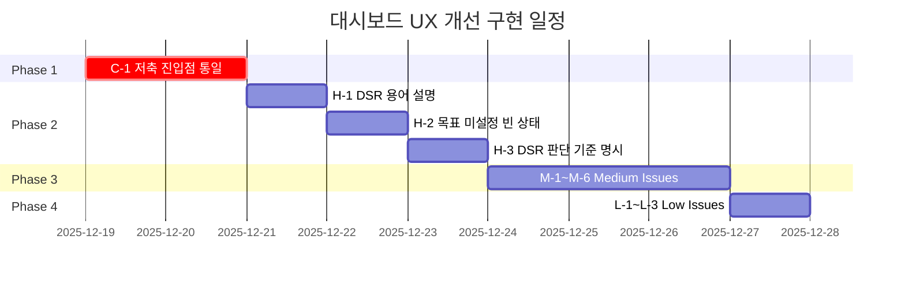

# 대시보드 UX 개선 구현 계획서

> **작성일**: 2025-12-18
> **기반 문서**: [UX-REVIEW-DASHBOARD.md](./UX-REVIEW-DASHBOARD.md)
> **총 이슈**: 13개 (Critical: 1, High: 3, Medium: 6, Low: 3)

---

## 목차

1. [개요](#개요)
2. [구현 우선순위 및 일정](#구현-우선순위-및-일정)
3. [Phase 1: Critical Priority](#phase-1-critical-priority)
4. [Phase 2: High Priority](#phase-2-high-priority)
5. [Phase 3: Medium Priority](#phase-3-medium-priority)
6. [Phase 4: Low Priority](#phase-4-low-priority)
7. [추가 개선 제안](#추가-개선-제안)
8. [공통 품질 기준 (DoD)](#공통-품질-기준-dod)
9. [검증 계획](#검증-계획)

---

## 개요

본 문서는 `UX-REVIEW-DASHBOARD.md`에서 발견된 UX 이슈들에 대한 상세 구현 계획을 정의합니다. 각 이슈에 대해 **현재 문제점**, **개선 방향**, **구체적 구현 내용**, **수정 대상 파일**을 명시합니다.

### 핵심 목표

| 목표 | 설명 |
|------|------|
| 🎯 **일관성** | 저축 진입점 UX 통일로 사용자 혼란 해소 |
| 📚 **이해도** | 금융 용어 설명 추가로 초보자 이해도 향상 |
| 🧭 **가이드** | 빈 상태(Empty State) UI로 다음 행동 안내 |
| 💡 **발견성** | 인터랙션 힌트로 클릭 가능한 요소 명확화 |

---

## 구현 우선순위 및 일정



| Phase | 이슈 | 예상 소요 | 예상 효과 |
|-------|------|----------|----------|
| **1** | C-1: 저축 진입점 UX 통일 | 2일 | 사용자 혼란 100% 해소 |
| **2** | H-1~H-3: DSR 설명 + 빈 상태 | 3일 | 금융 초보자 이해도 80%↑ |
| **3** | M-1~M-6: 힌트 및 가이드 | 3일 | 사용성 30%↑ |
| **4** | L-1~L-3: 폴리시 | 1일 | 완성도 향상 |

---

## Phase 1: Critical Priority

### C-1. 저축 진입점 UX 통일 (모달로 통일)

> [!IMPORTANT]
> **가장 중요한 이슈**: 같은 "저축하기" 기능이 진입점에 따라 다른 동작(모달 vs 페이지 이동)을 함

#### 현재 문제

| 진입점 | 위치 | 현재 동작 |
|--------|------|----------|
| "저축하기" 버튼 | `MainGoalCard.vue` | 모달 열기 (`SavingInputModal`) |
| 오늘 불꽃 클릭 | `WeeklyStreakCard.vue` | 페이지 이동 (대시보드에서 `Savings` 라우팅) |

#### 개선 방향: 모달로 통일 (권장)

**이유**:
1. 대시보드 맥락 유지 (목표 달성률, 스트릭 보면서 저축 가능)
2. 빠른 저축에 적합 (화면 전환 없이 완료)
3. 모바일 친화적 UX

#### 구현 내용

##### 1-1. MainGoalCard.vue 수정 (권장: 모달 소유권 상위로 이동)

현재 `MainGoalCard.vue`가 모달을 직접 렌더링하고 있는데, C-1을 “진입점 통일” 수준이 아니라 **“단일 모달 인스턴스”**로 완성하려면 모달을 `BentoGrid.vue`(또는 `DashboardView`)로 올리고, 각 카드에서는 `emit`으로 열기만 요청하는 구조가 유지보수에 유리합니다.

```javascript
// MainGoalCard.vue (개념)
const emit = defineEmits(['open-saving-modal'])
const openSavingModal = () => emit('open-saving-modal')
```

##### 1-2. WeeklyStreakCard.vue 수정 (이벤트명 정리)

```javascript
// 변경 전: open-savings 이벤트 emit (부모에서 Savings 라우팅)
const emit = defineEmits(['open-savings'])
const handleDayClick = (day) => {
  if (!day.isToday) return
  emit('open-savings')
}
```

```javascript
// 변경 후: 모달 열기 이벤트 emit (이벤트명만 명확화)
const emit = defineEmits(['open-saving-modal'])
const handleDayClick = (day) => {
  if (!day.isToday) return
  emit('open-saving-modal')
}
```

##### 1-3. BentoGrid.vue 수정 (라우팅 → 모달 열기)

```vue
<template>
  <MainGoalCard @open-saving-modal="openSavingModal" />
  <WeeklyStreakCard @open-saving-modal="openSavingModal" />
  <SavingInputModal :is-open="showModal" @close="showModal = false" />
</template>

<script setup>
import { ref } from 'vue'
const showModal = ref(false)
const openSavingModal = () => { showModal.value = true }
</script>
```

##### 1-4. SavingInputModal.vue 기능 강화

UX 리뷰에서 제안된 개선사항 통합:

| 신규 기능 | 설명 |
|----------|------|
| **목표 진행률 미니 표시** | 현재 목표명과 달성률 프로그레스 바 |
| **빠른 저축 버튼** | 1만원, 5만원, 10만원, 50만원 원클릭 저축 |
| **XP 미리보기** | 입력 금액에 따른 예상 경험치 표시 |

> [!WARNING]
> **XP 미리보기 정책 동기화 필요**
> 
> 프론트에서 "1만원당 1XP"처럼 하드코딩하면 백엔드 정책 변경 시 불일치 발생.
>
> **권장 구현 방안**:
> 1. **(권장) 백엔드 API 호출**: `GET /api/xp/estimate?amount={amount}` 엔드포인트로 예상 XP 조회
> 2. **(차선) 공유 상수**: 프론트/백엔드 공통 상수 파일로 XP 정책 관리
> 3. **(최소) 보수적 표현**: "예상 XP: 약 +5" 처럼 "약" 표현으로 불일치 리스크 완화

#### 수정 대상 파일

| 파일 | 수정 내용 |
|------|----------|
| [MainGoalCard.vue](../src/components/dashboard/bento/MainGoalCard.vue) | 모달 직접 렌더링 제거, `emit('open-saving-modal')`로 통일 |
| [WeeklyStreakCard.vue](../src/components/dashboard/bento/WeeklyStreakCard.vue) | `emit('open-savings')` → `emit('open-saving-modal')`로 명확화 |
| [BentoGrid.vue](../src/components/dashboard/BentoGrid.vue) | `router.push` 대신 모달 상태 관리 및 이벤트 핸들링 추가 |
| [SavingInputModal.vue](../src/components/modals/SavingInputModal.vue) | 빠른 저축 버튼, 목표 진행률, XP 미리보기 추가 |

---

## Phase 2: High Priority

### H-1. DSR 용어 설명 추가

#### 현재 문제

- "DSR 27.4%"가 무엇인지 금융 초보자는 이해 불가
- "총부채원리금상환비율" 정식 명칭 미노출
- 수치가 좋은 것인지 나쁜 것인지 판단 근거 없음

#### 개선 방향

**물음표 아이콘 클릭 시 툴팁으로 설명 제공**

#### 구현 내용

##### 템플릿

```vue
<div class="title-with-tooltip">
  <h3 class="card-title">DSR</h3>
  <button type="button" class="tooltip-trigger" @click="showDsrTooltip = !showDsrTooltip">
    <AppIcon name="questionCircle" :size="16" />
  </button>

  <Transition name="fade">
    <div v-if="showDsrTooltip" class="tooltip-content">
      <p class="tooltip-title">DSR (총부채원리금상환비율)</p>
      <p class="tooltip-desc">
        연 소득 대비 모든 대출의 원금+이자 상환액 비율이에요.
        <strong>40% 이하</strong>면 대출 승인이 유리해요.
      </p>
      <div class="tooltip-scale">
        <span class="scale-item safe">~40%: 안전</span>
        <span class="scale-item warning">40~70%: 주의</span>
        <span class="scale-item danger">70%+: 위험</span>
      </div>
    </div>
  </Transition>
</div>
```

#### 수정 대상 파일

| 파일 | 수정 내용 |
|------|----------|
| [DsrGaugeCard.vue](../src/components/dashboard/bento/DsrGaugeCard.vue) | 툴팁 트리거 버튼 + 툴팁 콘텐츠 추가 |

---

### H-2. 목표 미설정 시 Empty State UI

#### 현재 문제

- 목표 미설정 시 "입주까지 0원 남은 금액" 표시 → 목표 달성으로 오해 가능
- 행동 유도(CTA) 없음

#### 개선 방향

```
목표가 있을 때                     목표가 없을 때
┌─────────────────────────┐     ┌─────────────────────────┐
│ 28.5%     입주까지      │     │ ⭐                       │
│ [====]    1,250만원     │     │ 아직 목표가 없어요       │
│          [저축하기]     │     │ 꿈의 집을 선택하고       │
└─────────────────────────┘     │ 저축 목표를 시작해보세요! │
                                │ [🔍 매물 둘러보기]       │
                                └─────────────────────────┘
```

#### 구현 내용

##### 목표 설정 여부 판단 로직

```javascript
const { dreamHomeId } = storeToRefs(dreamHomeStore)
const hasGoal = computed(() => dreamHomeId.value != null)
```

##### Empty State 템플릿

```vue
<template v-else>
  <div class="empty-state-content">
    <div class="empty-icon-wrapper">
      <AppIcon name="sparkles" :size="24" :active="true" />
    </div>
    <h4 class="empty-title">아직 목표가 없어요</h4>
    <p class="empty-desc">
      꿈의 집을 선택하고<br>저축 목표를 시작해보세요!
    </p>
    <button class="explore-button" @click="goToProperties">
      <AppIcon name="search" :size="18" />
      <span>매물 둘러보기</span>
    </button>
  </div>
</template>
```

#### 수정 대상 파일

| 파일 | 수정 내용 |
|------|----------|
| [MainGoalCard.vue](../src/components/dashboard/bento/MainGoalCard.vue) | `hasGoal` computed 추가, Empty State 템플릿/스타일 추가 |

---

### H-3. DSR 상태 판단 기준 명시

#### 현재 문제

- 40%, 70% 기준이 사용자에게 노출되지 않음
- "매우 안전"이라는 표현만으로는 신뢰 부족

#### 개선 방향

**방안 A**: 상태 메시지에 수치 포함

```javascript
// 변경 전
if (dsrRatio.value <= 40) return '대출 승인 매우 안전'

// 변경 후
if (ratio <= 40) return `DSR ${ratio.toFixed(0)}% · 대출 승인 유리`
```

**방안 B**: 기준 안내 문구 추가 (권장)

```vue
<p class="dsr-criteria">
  <AppIcon name="info" :size="14" />
  <span>DSR 40% 이하 시 대부분의 은행에서 대출 승인이 용이해요</span>
</p>
```

#### 수정 대상 파일

| 파일 | 수정 내용 |
|------|----------|
| [DsrGaugeCard.vue](../src/components/dashboard/bento/DsrGaugeCard.vue) | 기준 안내 문구 추가 |

---

## Phase 3: Medium Priority

### M-1. 레벨 타이틀 설명 모달

#### 현재 문제

"터파기 건축가" 같은 레벨 타이틀의 의미가 불명확함

#### 개선 방향

레벨 칩 클릭 시 **레벨 시스템 설명 모달** 표시

#### 구현 내용

##### 신규 컴포넌트: LevelInfoModal.vue

```javascript
const levels = [
  { num: 1, title: '터파기 건축가', desc: '첫 저축 시작' },
  { num: 2, title: '기초 건축가', desc: '10만원 저축 달성' },
  { num: 3, title: '뼈대 건축가', desc: '50만원 저축 달성' },
  { num: 4, title: '지붕 건축가', desc: '100만원 저축 달성' },
  { num: 5, title: '외벽 건축가', desc: '300만원 저축 달성' },
  { num: 6, title: '완공 건축가', desc: '목표 달성!' }
]
```

#### 수정 대상 파일

| 파일 | 수정 내용 |
|------|----------|
| [ProfileCard.vue](../src/components/dashboard/bento/ProfileCard.vue) | 레벨 칩 클릭 이벤트 추가 |
| **[NEW]** `LevelInfoModal.vue` | 레벨 로드맵 표시 모달 컴포넌트 |

---

### M-2. Step 로드맵 툴팁

#### 현재 문제

"Step 1/6" 표시만으로는 전체 로드맵 파악 불가

#### 개선 방향

Progress dots에 hover 시 해당 단계 정보 툴팁 표시

#### 수정 대상 파일

| 파일 | 수정 내용 |
|------|----------|
| [IsometricRoomHero.vue](../src/components/dashboard/IsometricRoomHero.vue) | dot 요소에 hover 툴팁 추가 |

---

### M-3. 금액 표시 단위 일관성

#### 현재 문제

| 컴포넌트 | 현재 표시 | 문제점 |
|----------|----------|--------|
| MainGoalCard | "0원" | 일관성 있음 |
| DsrGaugeCard | "1,500,000원" | 가독성 낮음 |
| AssetGrowthCard | "0만" | "원" 누락 |

#### 개선 방향

공통 포맷터 함수를 **용도별로 분리**하여 혼란 방지

```javascript
// src/utils/formatters.js

/**
 * 정확한 원 단위 표시 (천 단위 콤마)
 * @example formatWon(15000000) → "15,000,000원"
 */
export function formatWon(amount) {
  if (amount === 0) return '0원'
  return `${amount.toLocaleString()}원`
}

/**
 * 읽기 쉬운 압축 형태 (만원/억원 단위)
 * @example formatWonCompact(15000000) → "1,500만원"
 * @example formatWonCompact(150000000) → "1억 5,000만원"
 */
export function formatWonCompact(amount) {
  if (amount === 0) return '0원'
  
  if (amount >= 100000000) {
    // 억 단위
    const billions = Math.floor(amount / 100000000)
    const millions = Math.floor((amount % 100000000) / 10000)
    if (millions > 0) {
      return `${billions}억 ${millions.toLocaleString()}만원`
    }
    return `${billions}억원`
  }
  
  if (amount >= 10000) {
    // 만원 단위
    return `${Math.floor(amount / 10000).toLocaleString()}만원`
  }
  
  return `${amount.toLocaleString()}원`
}

/**
 * 단위 생략 버전 (차트 라벨 등에 사용)
 * @example formatManwon(15000000) → "1,500만"
 */
export function formatManwon(amount) {
  if (amount === 0) return '0'
  if (amount >= 10000) {
    return `${Math.floor(amount / 10000).toLocaleString()}만`
  }
  return amount.toLocaleString()
}
```

#### 사용 가이드

| 함수 | 용도 | 예시 출력 |
|------|------|----------|
| `formatWon` | 정확한 금액 표시 (거래 내역, 입력 확인) | 15,000,000원 |
| `formatWonCompact` | 대시보드 카드, 요약 정보 | 1,500만원 |
| `formatManwon` | 차트 Y축 라벨, 축약 표시 | 1,500만 |

#### 수정 대상 파일

| 파일 | 수정 내용 |
|------|----------|
| [formatters.js](../src/utils/formatters.js) | `formatWon`, `formatWonCompact`, `formatManwon` 함수 추가 |
| 각 Bento 카드 컴포넌트 | 용도에 맞는 포맷터 적용 |

---

### M-4. 연속 활동 인터랙션 힌트

#### 현재 문제

오늘 불꽃이 클릭 가능한 요소임을 시각적으로 알 수 없음

#### 개선 방향

오늘 + 미완료 상태에서 "탭해서 저축!" 힌트 텍스트 표시

```vue
<span v-if="day.isToday && !day.completed" class="tap-hint">
  탭해서 저축!
</span>
```

```css
.tap-hint {
  position: absolute;
  bottom: -18px;
  font-size: 0.625rem;
  color: var(--brand-accent);
  animation: bounce 2s ease-in-out infinite;
}
```

#### 수정 대상 파일

| 파일 | 수정 내용 |
|------|----------|
| [WeeklyStreakCard.vue](../src/components/dashboard/bento/WeeklyStreakCard.vue) | 탭 힌트 텍스트 + 애니메이션 추가 |

---

### M-5. 자산 성장 빈 상태 CTA

#### 현재 문제

"저축을 시작하면 성장 그래프가 표시됩니다" 텍스트만 있고 행동 유도 없음

#### 개선 방향

- 예시 그래프 실루엣 배경
- "첫 저축 시작하기" 버튼 추가

#### 수정 대상 파일

| 파일 | 수정 내용 |
|------|----------|
| [AssetGrowthCard.vue](../src/components/dashboard/bento/AssetGrowthCard.vue) | Empty state 컨텐츠 개선, CTA 버튼 추가 |

---

### M-6. XP 획득 방법 설명

#### 현재 문제

XP가 어떻게 쌓이는지 설명 없음

#### 개선 방향

XP 정보 옆에 물음표 아이콘 → 클릭 시 획득 방법 툴팁

```vue
<ul class="xp-help-list">
  <li><strong>매일 접속</strong> +5 XP</li>
  <li><strong>저축 1만원당</strong> +1 XP</li>
  <li><strong>목표 달성</strong> +100 XP</li>
  <li><strong>7일 연속 스트릭</strong> +50 XP</li>
</ul>
```

#### 수정 대상 파일

| 파일 | 수정 내용 |
|------|----------|
| [ProfileCard.vue](../src/components/dashboard/bento/ProfileCard.vue) | XP 획득 방법 툴팁 추가 |

---

## Phase 4: Low Priority

### L-1. "AI 관리실" 명칭 변경

**현재**: "AI 관리실"
**제안**: "AI 재무 코치" 또는 "AI 상담"

#### 수정 대상 파일

| 파일 | 수정 내용 |
|------|----------|
| 네비게이션 관련 컴포넌트 | 메뉴 텍스트 변경 |

---

### L-2. 도넛 차트 0% 상태 시각적 피드백

#### 개선 방향

0% 상태에서 점선 테두리 + 느린 회전 애니메이션

```css
.donut-ring.empty {
  background: transparent;
  border: 2px dashed var(--border-muted);
  animation: rotate 20s linear infinite;
}
```

#### 수정 대상 파일

| 파일 | 수정 내용 |
|------|----------|
| [MainGoalCard.vue](../src/components/dashboard/bento/MainGoalCard.vue) | 0% 상태 스타일 추가 |

---

### L-3. 모바일 카드 순서 최적화

#### 현재 순서

profile → main → streak → dsr → growth

#### 제안 순서

main → profile → streak → dsr → growth

**이유**: 초보자 관점에서 "목표 달성률"이 먼저 보이는 것이 더 직관적

#### 수정 대상 파일

| 파일 | 수정 내용 |
|------|----------|
| [BentoGrid.vue](../src/components/dashboard/BentoGrid.vue) | 모바일 grid-template-areas 순서 변경 |

---

## 추가 개선 제안

UX 리뷰에서 언급되지 않았지만 추가로 고려할 수 있는 개선 사항:

### 1. 온보딩 투어 (Guided Tour)

첫 방문 시 각 카드의 역할을 안내하는 스텝-바이-스텝 투어

```
┌─────────────────────────────────────┐
│  👋 집-중에 오신 것을 환영해요!      │
│                                     │
│  [목표 달성률 카드를 가리키며]       │
│  여기서 저축 목표 진행 상황을        │
│  한눈에 확인할 수 있어요             │
│                                     │
│  [이전] [다음 1/5] [건너뛰기]       │
└─────────────────────────────────────┘
```

**장점**:
- 신규 사용자 온보딩 개선
- 각 기능 발견성 향상

**구현 방안**:
- `vue-tour` 또는 `driver.js` 라이브러리 활용
- LocalStorage로 투어 완료 여부 저장

### 2. 저축 성공 축하 애니메이션

저축 완료 후 confetti 또는 축하 모션으로 긍정적 피드백 강화

```javascript
import confetti from 'canvas-confetti'

const celebrateSaving = () => {
  confetti({
    particleCount: 100,
    spread: 70,
    origin: { y: 0.6 }
  })
}
```

### 3. 주간/월간 저축 목표 설정

현재 목표는 전체 금액 기준이지만, 주간/월간 마이크로 목표를 추가하면 동기부여 강화 가능

```
┌─────────────────────────────────────┐
│  📅 이번 주 목표: 5만원              │
│  ███████░░░░░░░░░░ 70% (3.5만원)    │
│  남은 기간: 3일                      │
└─────────────────────────────────────┘
```

### 4. 다크모드 전환 애니메이션

현재 다크모드 지원은 잘 되어 있지만, 전환 시 부드러운 fade 애니메이션 추가 권장

```css
html {
  transition: background-color 0.3s ease, color 0.3s ease;
}
```

---

## 공통 품질 기준 (DoD)

모든 모달/툴팁 관련 구현 시 아래 **Definition of Done** 체크리스트를 만족해야 합니다.

### 모달 접근성 체크리스트

| # | 항목 | 설명 | 확인 |
|---|------|------|------|
| 1 | **ESC 키로 닫기** | 키보드 ESC 입력 시 모달 닫힘 | ☐ |
| 2 | **외부 클릭으로 닫기** | 오버레이(배경) 클릭 시 모달 닫힘 | ☐ |
| 3 | **포커스 트랩** | 모달 열린 동안 Tab 키가 모달 내부에서만 순환 | ☐ |
| 4 | **aria-modal 속성** | `role="dialog"` + `aria-modal="true"` 적용 | ☐ |
| 5 | **aria-labelledby** | 모달 제목 요소를 `aria-labelledby`로 연결 | ☐ |
| 6 | **스크롤 락** | 모달 열린 동안 body 스크롤 방지 | ☐ |
| 7 | **자동 포커스** | 모달 열릴 때 첫 번째 interactive 요소로 포커스 이동 | ☐ |
| 8 | **포커스 복원** | 모달 닫힐 때 원래 trigger 요소로 포커스 복원 | ☐ |

### 툴팁 접근성 체크리스트

| # | 항목 | 설명 | 확인 |
|---|------|------|------|
| 1 | **ESC 키로 닫기** | 키보드 ESC 입력 시 툴팁 닫힘 | ☐ |
| 2 | **외부 클릭으로 닫기** | 툴팁 외부 클릭 시 닫힘 | ☐ |
| 3 | **aria-expanded** | trigger 버튼에 `aria-expanded` 상태 반영 | ☐ |
| 4 | **aria-controls** | trigger와 tooltip 영역 연결 | ☐ |
| 5 | **키보드 접근** | Enter/Space 키로 툴팁 토글 가능 | ☐ |
| 6 | **role="tooltip"** | 툴팁 콘텐츠에 적절한 role 속성 | ☐ |

### 공통 접근성 유틸리티

재사용 가능한 composable 함수 권장:

```javascript
// src/composables/useModal.js
import { ref, onMounted, onUnmounted, nextTick } from 'vue'

export function useModal() {
  const isOpen = ref(false)
  const triggerRef = ref(null)
  const modalRef = ref(null)

  const open = () => {
    isOpen.value = true
    document.body.style.overflow = 'hidden' // 스크롤 락
    nextTick(() => {
      // 첫 번째 focusable 요소로 포커스
      const firstFocusable = modalRef.value?.querySelector(
        'button, [href], input, select, textarea, [tabindex]:not([tabindex="-1"])'
      )
      firstFocusable?.focus()
    })
  }

  const close = () => {
    isOpen.value = false
    document.body.style.overflow = '' // 스크롤 복원
    triggerRef.value?.focus() // 포커스 복원
  }

  const handleKeydown = (e) => {
    if (e.key === 'Escape' && isOpen.value) {
      close()
    }
  }

  onMounted(() => document.addEventListener('keydown', handleKeydown))
  onUnmounted(() => document.removeEventListener('keydown', handleKeydown))

  return { isOpen, open, close, triggerRef, modalRef }
}
```

```javascript
// src/composables/useClickOutside.js
import { onMounted, onUnmounted } from 'vue'

export function useClickOutside(targetRef, callback) {
  const handleClick = (e) => {
    if (targetRef.value && !targetRef.value.contains(e.target)) {
      callback()
    }
  }

  onMounted(() => document.addEventListener('click', handleClick))
  onUnmounted(() => document.removeEventListener('click', handleClick))
}
```

---

## 검증 계획

### 1. 자동화 테스트 (Playwright E2E)

기존 테스트 파일 활용:
- `tests/dashboard.spec.js` - 대시보드 기본 테스트
- `tests/savings.spec.js` - 저축 기능 테스트

#### 추가 테스트 케이스

```javascript
// tests/dashboard-ux-improvements.spec.js

test('C-1: 스트릭 카드에서 오늘 불꽃 클릭 시 저축 모달 표시', async ({ page }) => {
  await page.goto('/dashboard')
  await page.locator('.day-item.today').click()
  await expect(page.locator('.saving-modal')).toBeVisible()
})

test('H-1: DSR 툴팁 표시 확인', async ({ page }) => {
  await page.goto('/dashboard')
  await page.locator('.dsr-gauge-card .tooltip-trigger').click()
  await expect(page.locator('.tooltip-content')).toBeVisible()
  await expect(page.locator('.tooltip-content')).toContainText('총부채원리금상환비율')
})

test('H-2: 목표 미설정 시 Empty State 표시', async ({ page }) => {
  // 목표 미설정 상태로 접근 (mock 필요)
  await page.goto('/dashboard')
  await expect(page.locator('.empty-state-content')).toBeVisible()
  await expect(page.locator('.explore-button')).toBeVisible()
})
```

실행 방법:
```bash
cd jipjung-frontend
npx playwright test tests/dashboard-ux-improvements.spec.js
```

### 2. 수동 테스트 체크리스트

#### Phase 1 (C-1) 검증

| # | 테스트 항목 | 예상 결과 | 확인 |
|---|------------|----------|------|
| 1 | MainGoalCard "저축하기" 버튼 클릭 | 저축 모달 표시 | ☐ |
| 2 | WeeklyStreakCard 오늘 불꽃 클릭 | **동일하게** 저축 모달 표시 (페이지 이동 X) | ☐ |
| 3 | 모달에서 빠른 저축 버튼 작동 | 금액 자동 입력 | ☐ |
| 4 | 모달에서 XP 미리보기 표시 | 입력 금액에 따라 XP 계산 표시 | ☐ |

#### Phase 2 (H-1~H-3) 검증

| # | 테스트 항목 | 예상 결과 | 확인 |
|---|------------|----------|------|
| 1 | DSR 카드 물음표 아이콘 클릭 | 툴팁 표시 | ☐ |
| 2 | 툴팁에 "총부채원리금상환비율" 설명 포함 | 용어 설명 확인 | ☐ |
| 3 | 목표 미설정 상태로 대시보드 접근 | Empty State UI 표시 | ☐ |
| 4 | "매물 둘러보기" 버튼 클릭 | /properties 페이지 이동 | ☐ |

### 3. 스크린샷 비교

Playwright 스크린샷 기능으로 변경 전후 비교:

```javascript
await page.screenshot({ 
  path: 'screenshots/dashboard-after-ux-improvements.png',
  fullPage: true 
})
```

---

## 파일 변경 요약

| 파일 | 변경 유형 | 관련 이슈 |
|------|----------|----------|
| `WeeklyStreakCard.vue` | MODIFY | C-1, M-4 |
| `BentoGrid.vue` | MODIFY | C-1, L-3 |
| `SavingInputModal.vue` | MODIFY | C-1 |
| `DsrGaugeCard.vue` | MODIFY | H-1, H-3 |
| `MainGoalCard.vue` | MODIFY | H-2, L-2 |
| `ProfileCard.vue` | MODIFY | M-1, M-6 |
| `IsometricRoomHero.vue` | MODIFY | M-2 |
| `AssetGrowthCard.vue` | MODIFY | M-5 |
| `formatters.js` | MODIFY | M-3 |
| **LevelInfoModal.vue** | NEW | M-1 |

---

*Generated by Claude Code*
