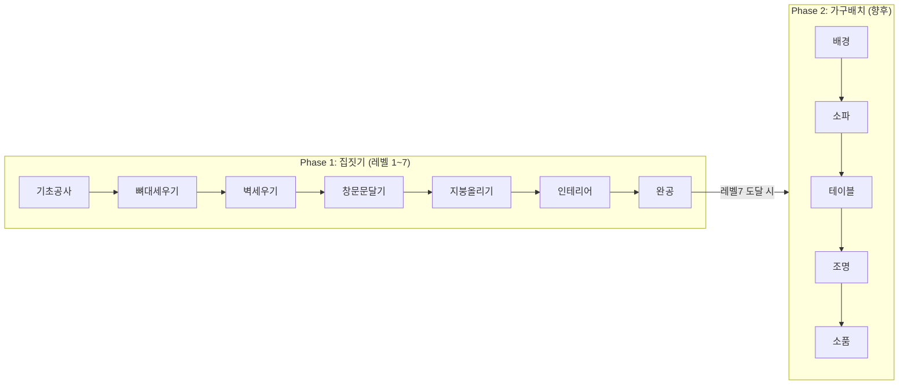

# 집 테마 게이미피케이션 리팩토링 PRD

> **버전**: 1.1 (2025-12-12 리뷰 반영)
> **상태**: Draft → Review 반영 완료

---

## 0. 핵심 결정 사항 (Design Decisions)

> [!IMPORTANT]
> 이 섹션은 리뷰 피드백을 반영하여 모호한 부분을 확정한 내용입니다.

### 0.1 메시지 소스 정책 (P0)

**결정: 선택지 A - 메시지는 전 테마 공통**

| 구분 | 결정 내용 |
|------|----------|
| 단계명/설명 | `growth_levels` 테이블의 `step_name`, `description` 사용 |
| 테마 역할 | 이미지(SVG) URL만 테마별로 다름 |
| 근거 | 현재 `GrowthLevel` 도메인이 이미 존재하고, 테마별 메시지 차별화 우선순위가 낮음 |
| 향후 확장 | P2에서 `theme_growth_levels` 테이블 신설 시 테마별 메시지 지원 가능 |

---

### 0.2 API 응답 구조 (P0)

**결정: `data.showroom` 경로 사용 (REST_API.md 기준)**

기존 대시보드 API 명세(`REST_API.md` 라인 429-435)와 일치:

```json
{
  "code": 200,
  "status": "OK",
  "data": {
    "showroom": {
      "themeId": 1,
      "themeCode": "MODERN",
      "themeName": "모던 하우스",
      "currentStep": 3,
      "totalSteps": 7,
      "stepTitle": "벽 세우기",
      "stepDescription": "방의 윤곽이 드러나고 있어요.",
      "imageUrl": "https://storage.googleapis.com/.../phase3.svg"
    }
  }
}
```

**프론트엔드 매핑:**
```javascript
// authStore.js
const userShowroom = computed(() => user.value?.showroom || null)

// IsometricRoomHero.vue
const showroom = computed(() => authStore.user?.showroom || {})
const themeImageUrl = computed(() => showroom.value.imageUrl || '/phase7.svg')
const currentStep = computed(() => ({
  label: showroom.value.stepTitle || '준비 중',
  message: showroom.value.stepDescription || ''
}))
```

> [!WARNING]
> 기존 코드에서 `authStore.user?._raw?.showroom`을 사용하던 부분은
> `authStore.user?.showroom`으로 통일해야 합니다.

---

### 0.3 레거시 사용자 처리 (P0)

**결정: 읽기 시 폴백만 (DB 영구 할당 안 함)**

| 시나리오 | 동작 |
|----------|------|
| `selectedThemeId = null` | 대시보드 조회 시 기본 테마(MODERN, themeId=1) 이미지 반환 |
| DB 저장 | 사용자가 직접 테마를 선택할 때만 `selectedThemeId` 업데이트 |
| UI 정책 | 첫 드림홈 설정 시 테마 선택 모달이 필수로 표시됨 (현재 구현 완료) |

```java
// ShowroomService.java
public ShowroomInfo getShowroomInfo(Long userId) {
    User user = userMapper.findById(userId);
    Integer themeId = user.getSelectedThemeId();
    Integer level = user.getCurrentLevel() != null ? user.getCurrentLevel() : 1;
    
    // 테마 미선택 시 기본 테마(themeId=1)로 폴백 (DB 저장 안 함)
    int effectiveThemeId = (themeId != null) ? themeId : 1;
    
    ThemeAsset asset = themeAssetMapper.findByThemeIdAndLevel(effectiveThemeId, level);
    // ...
}
```

---

### 0.4 레벨 경계 규칙 (P1)

**결정: 클램프 + 최근접 하위 폴백**

| 상황 | 처리 |
|------|------|
| `currentLevel > MAX_LEVEL(7)` | `MAX_LEVEL`로 클램프 |
| `currentLevel < 1` | `1`로 클램프 |
| `theme_assets`에 해당 레벨 없음 | 하위 레벨 중 가장 가까운 에셋 사용 |
| 모든 에셋 없음 | 기본 이미지 `/phase7.svg` 반환 |

> [!NOTE]
> `ThemeAsset.DEFAULT_IMAGE_URL`는 `/phase7.svg`로 고정하며, 프론트엔드 폴백(`/phase7.svg`)과 동일합니다.

```java
// ThemeAssetMapper.xml
<select id="findByThemeIdAndLevel" resultType="ThemeAsset">
    SELECT * FROM theme_assets
    WHERE theme_id = #{themeId}
      AND level <= #{level}
      AND is_deleted = false
    ORDER BY level DESC
    LIMIT 1
</select>
```

---

### 0.5 Phase 1 vs Phase 2 관계 (P1)

**결정: 현재 스코프는 Phase 1(집짓기)만 지원**

| Phase | 레벨 범위 | 상태 |
|-------|----------|------|
| Phase 1 (집짓기) | 레벨 1~7 | ✅ 이번 PRD 범위 |
| Phase 2 (가구배치) | 별도 진행 | ❌ 향후 확장 |



**향후 확장 시 필요한 변경:**
- `User` 테이블에 `currentPhase` 필드 추가
- `showroom` 응답에 `phase`, `furnitureLevel` 필드 추가
- `furniture_assets` 테이블 신설

---

### 0.6 gamificationStore 동적화 (P1)

**결정: 배지 메시지는 대시보드 응답에서 충분**

현재 `gamificationStore`의 `HOUSE_BADGE_MESSAGES`는 배지 획득 시 표시용입니다.
레벨업 시 백엔드가 반환하는 `growth.levelLabel`/`growth.description`을 사용합니다.

> [!NOTE]
> 레벨업 API 응답의 필드명은 기존 그대로 `levelLabel`, `description`을 유지합니다. `showroom.stepTitle/stepDescription`과 내용은 동일하지만 용도(현재 단계 표시 vs 배지 메시지 표시)가 다릅니다.

```javascript
// gamificationStore.js - applyGrowthResult()
function applyGrowthResult(growth) {
  if (!growth) return
  
  // 백엔드 응답의 levelLabel 사용
  const newBadgeMessage = growth.levelLabel || HOUSE_BADGE_MESSAGES[growth.level - 1] || '새로운 단계!'
  
  authStore.updateUserData({
    gamification: {
      ...authStore.userGamification,
      currentLevel: growth.level,
      experiencePoints: growth.currentExp,
      nextLevelExp: growth.maxExp,
      levelTitle: growth.levelLabel
    }
  })
}
```

> [!NOTE]
> 전체 레벨 목록이 필요한 경우 `/api/growth-levels` 엔드포인트를 P2에서 추가합니다.

---

### 0.7 GCS URL 전략 (P2)

**결정: Public CDN URL 사용 (Signed URL 미사용)**

| 항목 | 결정 |
|------|------|
| 버킷 설정 | `allUsers` 공개 읽기 권한 |
| URL 형식 | `https://storage.googleapis.com/jipjung-assets/themes/{themeCode}/phase{level}.svg` |
| CDN | Cloud CDN 연동으로 캐싱 |
| 갱신 정책 | 이미지 변경 시 URL 버저닝 (`?v=20251212`) |

---

## 1. 현재 상태 분석

### 1.1 문제점

| 파일 | 문제 |
|------|------|
| `IsometricRoomHero.vue` | `HOUSE_STEPS`, `FURNITURE_STEPS` 하드코딩 (라인 63-79) |
| `gamificationStore.js` | `HOUSE_BADGE_MESSAGES`, `FURNITURE_BADGE_MESSAGES` 하드코딩 (라인 10-26) |
| 대시보드 API | `showroom.imageUrl`이 테마/레벨 기반으로 동적 반환되지 않음 |

### 1.2 기존 인프라 (활용 가능)

| 컴포넌트 | 상태 | 위치 |
|----------|------|------|
| `HouseTheme` 도메인 | ✅ 존재 | [HouseTheme.java](file:///c:/Users/gds05/OneDrive/바탕%20화면/jipjung/jipjung-backend/src/main/java/com/jipjung/project/domain/HouseTheme.java) |
| `ThemeAsset` 도메인 | ✅ 존재 | [ThemeAsset.java](file:///c:/Users/gds05/OneDrive/바탕%20화면/jipjung/jipjung-backend/src/main/java/com/jipjung/project/domain/ThemeAsset.java) |
| `GrowthLevel` 도메인 | ✅ 존재 | [GrowthLevel.java](file:///c:/Users/gds05/OneDrive/바탕%20화면/jipjung/jipjung-backend/src/main/java/com/jipjung/project/domain/GrowthLevel.java) |
| `User.selectedThemeId` | ✅ 존재 | [User.java](file:///c:/Users/gds05/OneDrive/바탕%20화면/jipjung/jipjung-backend/src/main/java/com/jipjung/project/domain/User.java#L61) |
| 테마 선택 모달 플로우 | ✅ 구현됨 | `ThemeSelectModal.vue` → `DreamHomeSetModal.vue` |
| `ThemeController` | ✅ 존재 | [ThemeController.java](file:///c:/Users/gds05/OneDrive/바탕%20화면/jipjung/jipjung-backend/src/main/java/com/jipjung/project/controller/ThemeController.java) |

---

## 2. 상세 변경 사항

### 2.1 백엔드

---

#### [MODIFY] ThemeAssetMapper.java / ThemeAssetMapper.xml

`findByThemeIdAndLevel()` 메서드 추가:

```java
// ThemeAssetMapper.java
ThemeAsset findByThemeIdAndLevel(@Param("themeId") Integer themeId, @Param("level") Integer level);
```

```xml
<!-- ThemeAssetMapper.xml -->
<select id="findByThemeIdAndLevel" resultType="ThemeAsset">
    SELECT asset_id, theme_id, level, image_url, created_at, updated_at, is_deleted
    FROM theme_assets
    WHERE theme_id = #{themeId}
      AND level <= #{level}
      AND is_deleted = false
    ORDER BY level DESC
    LIMIT 1
</select>
```

---

#### [NEW] ShowroomDTO.java

```java
@Getter
@Builder
public class ShowroomDTO {
    private Integer themeId;
    private String themeCode;
    private String themeName;
    private Integer currentStep;   // currentLevel
    private Integer totalSteps;    // 7 (MAX_LEVEL)
    private String stepTitle;      // GrowthLevel.stepName
    private String stepDescription; // GrowthLevel.description
    private String imageUrl;       // ThemeAsset.imageUrl
    
    /**
     * 최후 폴백용 showroom.
     * 레거시 사용자 기본 테마 폴백은 effectiveThemeId=1로 처리하며,
     * 이 메서드는 테마/레벨/에셋/성장레벨 조회가 모두 실패한 경우에만 사용합니다.
     */
    public static ShowroomDTO defaultShowroom() {
        return ShowroomDTO.builder()
            .themeId(null)
            .themeCode(null)
            .themeName("기본(폴백)")
            .currentStep(1)
            .totalSteps(7)
            .stepTitle("준비 중")
            .stepDescription("집을 짓기 위한 준비를 하고 있어요.")
            .imageUrl(ThemeAsset.DEFAULT_IMAGE_URL) // "/phase7.svg"
            .build();
    }
}
```

---

#### [MODIFY] UserService.java 또는 DashboardService.java

`buildShowroomDTO()` 메서드 추가:

```java
private ShowroomDTO buildShowroomDTO(User user) {
    Integer themeId = user.getSelectedThemeId();
    Integer level = clampLevel(user.getCurrentLevel());
    
    int effectiveThemeId = (themeId != null) ? themeId : 1;
    
    HouseTheme theme = houseThemeMapper.findById(effectiveThemeId);
    GrowthLevel growth = growthLevelMapper.findByLevel(level);
    ThemeAsset asset = themeAssetMapper.findByThemeIdAndLevel(effectiveThemeId, level);
    
    return ShowroomDTO.builder()
        .themeId(theme != null ? theme.getThemeId() : null)
        .themeCode(theme != null ? theme.getThemeCode() : null)
        .themeName(theme != null ? theme.getThemeName() : "기본")
        .currentStep(level)
        .totalSteps(MAX_LEVEL)
        .stepTitle(growth != null ? growth.getStepName() : "진행 중")
        .stepDescription(growth != null ? growth.getDescription() : "")
        .imageUrl(asset != null ? asset.getImageUrl() : ThemeAsset.DEFAULT_IMAGE_URL)
        .build();
}

private int clampLevel(Integer level) {
    if (level == null || level < 1) return 1;
    if (level > MAX_LEVEL) return MAX_LEVEL;
    return level;
}
```

---

### 2.2 프론트엔드

---

#### [MODIFY] [IsometricRoomHero.vue](file:///c:/Users/gds05/OneDrive/바탕%20화면/jipjung/jipjung-frontend/src/components/dashboard/IsometricRoomHero.vue)

**변경 1: 하드코딩 배열 제거, 백엔드 데이터 사용**

```diff
- const HOUSE_STEPS = [
-   { id: 1, title: '기초 공사', label: '씨앗 심기', message: '토대를 다지고 집나무를 심었어요.' },
-   // ... 7개
- ]

+ // 백엔드 showroom 데이터 사용
+ const showroom = computed(() => authStore.user?.showroom || {})
+ 
+ const activeStage = computed(() => showroom.value.currentStep || 1)
+ const totalStages = computed(() => showroom.value.totalSteps || 7)
+ const currentStep = computed(() => ({
+   label: showroom.value.stepTitle || '준비 중',
+   message: showroom.value.stepDescription || ''
+ }))
```

**변경 2: themeImageUrl 수정**

```diff
  const themeImageUrl = computed(() => {
-   const showroom = authStore.user?._raw?.showroom
-   return showroom?.imageUrl || '/phase7.svg'
+   return authStore.user?.showroom?.imageUrl || '/phase7.svg'
  })
```

---

#### [MODIFY] [authStore.js](file:///c:/Users/gds05/OneDrive/바탕%20화면/jipjung/jipjung-frontend/src/stores/authStore.js)

대시보드 응답에서 `showroom` 데이터가 올바르게 매핑되는지 확인:

```javascript
// authStore.js - loadDashboard() (예시)
const res = await dashboardService.getDashboard()
const { user, dreamHome, gamification, showroom } = res.data

user.value = {
  ...user,
  dreamHome,
  gamification,
  showroom, // data.showroom → user.showroom으로 1:1 매핑
}

const userShowroom = computed(() => user.value?.showroom || null)

export { userShowroom }
```

---

### 2.3 데이터베이스

---

#### theme_assets 테이블 시드 데이터

```sql
-- 마이그레이션: V3__insert_theme_assets.sql (Flyway 사용 시)

-- MODERN 테마 (themeId=1)
INSERT INTO theme_assets (theme_id, level, image_url, is_deleted) VALUES
(1, 1, 'https://storage.googleapis.com/jipjung-assets/themes/modern/phase1.svg', false),
(1, 2, 'https://storage.googleapis.com/jipjung-assets/themes/modern/phase2.svg', false),
(1, 3, 'https://storage.googleapis.com/jipjung-assets/themes/modern/phase3.svg', false),
(1, 4, 'https://storage.googleapis.com/jipjung-assets/themes/modern/phase4.svg', false),
(1, 5, 'https://storage.googleapis.com/jipjung-assets/themes/modern/phase5.svg', false),
(1, 6, 'https://storage.googleapis.com/jipjung-assets/themes/modern/phase6.svg', false),
(1, 7, 'https://storage.googleapis.com/jipjung-assets/themes/modern/phase7.svg', false);

-- HANOK 테마 (themeId=2)
INSERT INTO theme_assets (theme_id, level, image_url, is_deleted) VALUES
(2, 1, 'https://storage.googleapis.com/jipjung-assets/themes/hanok/phase1.svg', false),
-- ... 동일 패턴

-- CASTLE 테마 (themeId=3)
INSERT INTO theme_assets (theme_id, level, image_url, is_deleted) VALUES
(3, 1, 'https://storage.googleapis.com/jipjung-assets/themes/castle/phase1.svg', false);
-- ... 동일 패턴
```

#### growth_levels 테이블 시드 데이터

```sql
-- 마이그레이션: V2__insert_growth_levels.sql

INSERT INTO growth_levels (level, step_name, description, required_exp, is_deleted) VALUES
(1, '기초 공사', '토대를 다지고 집나무를 심었어요.', 0, false),
(2, '뼈대 세우기', '튼튼한 골조가 올라가요.', 100, false),
(3, '벽 세우기', '방의 윤곽이 드러나고 있어요.', 300, false),
(4, '창문·문 달기', '빛과 바람이 드나드는 집이 되네요.', 600, false),
(5, '지붕 올리기', '집의 형태가 완성 단계예요.', 1000, false),
(6, '인테리어 공정', '내부를 정돈하고 있어요.', 1500, false),
(7, '입주 준비 완료', '집이 완성됐어요! 이제 가구를 채워요.', 2100, false);
```

**테마 추가 시 체크리스트:**
- [ ] `house_themes` 테이블에 테마 레코드 추가
- [ ] `theme_assets` 테이블에 레벨 1~7 이미지 URL 추가
- [ ] GCS에 7개 SVG 파일 업로드
- [ ] `ThemeSelectModal`에서 테마 목록 조회 확인

---

## 3. 구현 우선순위

### Phase 1: 핵심 연동 (필수)

| # | 작업 | 담당 | DoD (Definition of Done) |
|---|------|------|--------------------------|
| 1 | `ThemeAssetMapper.findByThemeIdAndLevel()` 구현 | BE | 단위 테스트 통과, 폴백 동작 검증 |
| 2 | Dashboard API에 `ShowroomDTO` 포함 | BE | Swagger에서 응답 확인 |
| 3 | `IsometricRoomHero.vue` 하드코딩 배열 완전 제거 | FE | `HOUSE_STEPS` 배열 0개 |
| 4 | `authStore` 매핑 경로 통일 | FE | `user.showroom` 경로만 사용 |
| 5 | `theme_assets` 시드 데이터 입력 | DB | 3개 테마 × 7레벨 = 21개 에셋 |

### Phase 2: 보강 (권장)

| # | 작업 | 담당 | DoD |
|---|------|------|-----|
| 6 | `gamificationStore` 하드코딩 메시지 동적화 | FE | 백엔드 `levelLabel` 우선 사용 |
| 7 | GCS 이미지 업로드 및 CDN 연동 | Infra | 이미지 로딩 시간 < 500ms |
| 8 | 레벨 경계 테스트 케이스 | BE | 레벨 0, 8, 에셋 누락 테스트 통과 |

### Phase 3: 확장 (선택)

| # | 작업 | 담당 | DoD |
|---|------|------|-----|
| 9 | Phase 2 (가구배치) 스키마 설계 | BE | ERD 문서화 |
| 10 | `/api/growth-levels` 엔드포인트 | BE | 전체 레벨 목록 조회 가능 |
| 11 | 테마별 메시지 지원 (`theme_growth_levels`) | BE/DB | 신규 테이블 마이그레이션 |

---

## 4. 검증 계획

### 4.1 자동화 테스트 (Backend)

```bash
# 1. ThemeAssetMapper 단위 테스트
cd jipjung-backend
./mvnw test -Dtest=ThemeAssetMapperTest

# 2. ShowroomService 테스트 (추가 필요)
./mvnw test -Dtest=ShowroomServiceTest

# 테스트 케이스:
# - 테마 선택된 사용자: 해당 테마+레벨 이미지 반환
# - 테마 미선택 사용자: 기본 테마(themeId=1) 이미지 반환
# - 레벨 경계: 0 → 1 클램프, 10 → 7 클램프
# - 에셋 누락: 레벨 5 에셋 없음 → 레벨 4 에셋 폴백
# - 모든 에셋 없음: 기본 이미지 반환
```

### 4.2 수동 검증 (Frontend)

| # | 시나리오 | 예상 결과 | 확인 방법 |
|---|----------|----------|----------|
| 1 | 신규 사용자 대시보드 접속 | 기본 테마(MODERN) 레벨 1 이미지 | 개발자 도구 Network 탭에서 `phase1.svg` 요청 확인 |
| 2 | 테마 선택 후 대시보드 접속 | 선택한 테마의 레벨 이미지 | 이미지 URL에 테마 코드 포함 확인 |
| 3 | 저축 → 레벨업 → 새로고침 | 다음 레벨 이미지로 변경 | `currentStep` 증가, 이미지 변경 확인 |
| 4 | Night/Day 모드 전환 | SVG 표시 정상 | 두 모드에서 이미지 깨짐 없음 |
| 5 | 네트워크 오류 시 | 폴백 이미지 (`/phase7.svg`) 표시 | 개발자 도구에서 GCS URL 차단 후 확인 |

---

## 5. 예상 리스크 및 대응

| 리스크 | 영향도 | 대응 방안 |
|--------|--------|-----------|
| GCS 이미지 CORS 오류 | 높음 | 버킷에 CORS 설정 필수 (`Access-Control-Allow-Origin: *`) |
| 레거시 사용자 마이그레이션 | 낮음 | 읽기 시 폴백으로 해결, DB 변경 불필요 |
| 프론트엔드 캐싱 문제 | 중간 | 대시보드 API 응답에 `Cache-Control: no-cache` 또는 버전 쿼리 |
| SVG 로딩 실패 | 중간 | `svgError` 상태로 폴백 UI 표시 (이미 구현됨) |

---

## 6. 참고 파일

### Backend
- [HouseTheme.java](file:///c:/Users/gds05/OneDrive/바탕%20화면/jipjung/jipjung-backend/src/main/java/com/jipjung/project/domain/HouseTheme.java)
- [ThemeAsset.java](file:///c:/Users/gds05/OneDrive/바탕%20화면/jipjung/jipjung-backend/src/main/java/com/jipjung/project/domain/ThemeAsset.java)
- [GrowthLevel.java](file:///c:/Users/gds05/OneDrive/바탕%20화면/jipjung/jipjung-backend/src/main/java/com/jipjung/project/domain/GrowthLevel.java)
- [DreamHomeService.java](file:///c:/Users/gds05/OneDrive/바탕%20화면/jipjung/jipjung-backend/src/main/java/com/jipjung/project/service/DreamHomeService.java)
- [REST_API.md](file:///c:/Users/gds05/OneDrive/바탕%20화면/jipjung/jipjung-backend/REST_API.md) (대시보드 showroom 섹션: 라인 429-435)

### Frontend
- [IsometricRoomHero.vue](file:///c:/Users/gds05/OneDrive/바탕%20화면/jipjung/jipjung-frontend/src/components/dashboard/IsometricRoomHero.vue)
- [gamificationStore.js](file:///c:/Users/gds05/OneDrive/바탕%20화면/jipjung/jipjung-frontend/src/stores/gamificationStore.js)
- [dreamHomeStore.js](file:///c:/Users/gds05/OneDrive/바탕%20화면/jipjung/jipjung-frontend/src/stores/dreamHomeStore.js)
- [authStore.js](file:///c:/Users/gds05/OneDrive/바탕%20화면/jipjung/jipjung-frontend/src/stores/authStore.js)

### 기획 문서
- [기획안.md](file:///c:/Users/gds05/OneDrive/바탕%20화면/jipjung/jipjung-frontend/docs/기획안.md)
