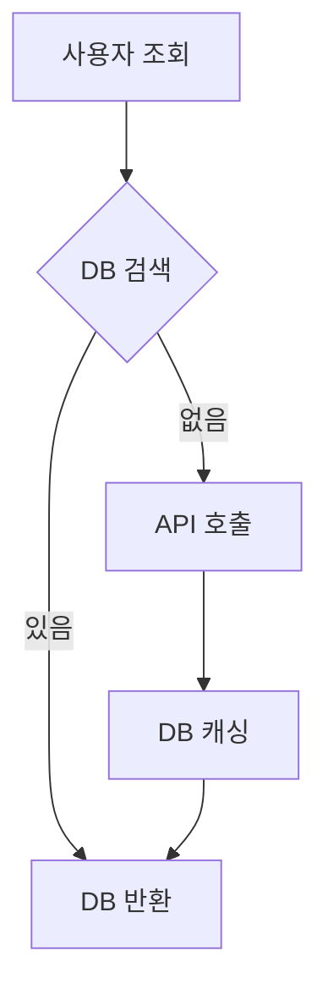

# 국토부 실거래가 API 연동 계획

## 개요

Mock 데이터 → **국토부 아파트 실거래가 API** 전환. DB 캐싱으로 백로그 활용.

---

## 🔑 API 키 설정

```properties
# application.properties
molit.api.key=${MOLIT_API_KEY}           # URL-encoded 키 권장
molit.api.key-encoded=true               # Decoded 키면 false
molit.api.base-url=https://apis.data.go.kr/1613000/RTMSDataSvcAptTrade/getRTMSDataSvcAptTrade
```

> **주의**: 환경변수 또는 `application-local.properties`에 실제 키 설정. 절대 코드에 키를 하드코딩하지 마세요!  
> 공공데이터포털은 **Encoding/Decoding 키를 둘 다 제공**하므로, 실제로 동작하는 키 형태를 확인한 뒤 `molit.api.key-encoded`를 맞춰 사용합니다.

---

## 📋 동기화 전략 (하이브리드)



| 방식 | 용도 | 트리거 |
|------|------|--------|
| **초기 로딩** | 테스트용 최소 데이터 | 수동 (1회) |
| **실시간 Fallback** | DB 미스 시 API → 캐싱 | 자동 |

> **주간 배치는 제외** - 일일 1,000회 API 제한으로 대량 동기화 불가. 실시간 Fallback + 캐싱으로 대체.

---

## 🔧 국토부 API 사양

### 요청

```
GET https://apis.data.go.kr/1613000/RTMSDataSvcAptTrade/getRTMSDataSvcAptTrade
    ?serviceKey={API_KEY_URL_ENCODED}
    &LAWD_CD={지역코드}
    &DEAL_YMD={계약년월}
    &numOfRows=100
    &pageNo=1
```

> End Point: `https://apis.data.go.kr/1613000/RTMSDataSvcAptTrade`  
> 실제 호출은 위 End Point에 `getRTMSDataSvcAptTrade`를 붙인 메서드 경로 사용

| 파라미터 | 필수 | 설명 | 예시 |
|----------|------|------|------|
| `serviceKey` | O | 인증키 (URL Encoded) | `raG3BZ...` |
| `LAWD_CD` | O | 지역코드 - 법정동코드 앞 5자리 | `11680` (강남구) |
| `DEAL_YMD` | O | 계약년월 (YYYYMM) | `202412` |
| `numOfRows` | X | 페이지당 건수 | `100` |

### 응답 (XML)

```xml
<?xml version="1.0" encoding="UTF-8"?>
<response>
  <header>
    <resultCode>00</resultCode>
    <resultMsg>NORMAL SERVICE.</resultMsg>
  </header>
  <body>
    <items>
      <item>
        <sggCd>11680</sggCd>
        <umdNm>역삼동</umdNm>
        <aptNm>래미안역삼</aptNm>
        <jibun>123-45</jibun>
        <excluUseAr>84.99</excluUseAr>
        <dealYear>2024</dealYear>
        <dealMonth>12</dealMonth>
        <dealDay>5</dealDay>
        <dealAmount> 185,000</dealAmount>
        <floor>12</floor>
        <buildYear>2015</buildYear>
        <aptDong>101</aptDong>
        <cdealType></cdealType>
        <dealingGbn>중개거래</dealingGbn>
      </item>
    </items>
    <totalCount>523</totalCount>
    <numOfRows>100</numOfRows>
    <pageNo>1</pageNo>
  </body>
</response>
```

### 응답 필드 ↔ DB 매핑 (파싱 필요)

| API 필드 | 타입 | DB 테이블.컬럼 | 변환 로직 |
|----------|------|----------------|-----------|
| `sggCd` | string | `apartment.sgg_cd` | 그대로 |
| `umdNm` | string | `apartment.umd_nm` | 그대로 |
| `aptNm` | string | `apartment.apt_nm` | 그대로 |
| `jibun` | string | `apartment.jibun` | 그대로 |
| `buildYear` | string | `apartment.build_year` | `Integer.parseInt()` |
| `excluUseAr` | string | `apartment_deal.exclu_use_ar` | `new BigDecimal(trim())` |
| `dealYear` | string | `apartment_deal.deal_year` | `Integer.parseInt()` |
| `dealMonth` | string | `apartment_deal.deal_month` | `Integer.parseInt()` |
| `dealDay` | string | `apartment_deal.deal_day` | `Integer.parseInt()` |
| `dealAmount` | string | `apartment_deal.deal_amount` | `.trim().replace(",", "")` (만원 문자열) |
| `floor` | string | `apartment_deal.floor` | 그대로 |
| `aptDong` | string | `apartment_deal.apt_dong` | 그대로 |
| `cdealType` | string | - | 해제 거래 필터용 (값 확인 필요, 기본은 non-empty = 해제) |
| `cdealDay` | string | - | 해제사유발생일 |
| `dealingGbn` | string | - | 거래유형 (중개/직거래) |
| `estateAgentSggNm` | string | - | 현 스키마 없음 → 저장하지 않음 |
| `rgstDate` | string | - | 현 스키마 없음 → 저장하지 않음 |
| `slerGbn` | string | - | 현 스키마 없음 → 저장하지 않음 |
| `buyerGbn` | string | - | 현 스키마 없음 → 저장하지 않음 |
| `landLeaseholdGbn` | string | - | 현 스키마 없음 → 저장하지 않음 |

> **dealAmount 단위**: 현재 DB 스키마는 **만원 기준**(`deal_amount`, `deal_amount_num`)이므로 만원 문자열로 저장.  
> 원 단위가 필요하면 **조회/응답에서 `* 10000`** 변환하거나 스키마/생성컬럼 변경이 필요합니다.

> **apt_seq 생성**: `VARCHAR(20)` 제약을 고려해 `sggCd + "-" + 안정적 해시(umdNm|aptNm|jibun)`로 생성  
> (예: `sggCd + "-" + sha256(...).substring(0, 12)`), Java `hashCode()` 대신 충돌 위험이 낮은 해시 사용  
> 해시 구현은 `MessageDigest` 또는 `commons-codec` (`DigestUtils`) 중 하나로 통일

---

## 📊 테스트용 최소 범위

| 항목 | 값 |
|------|-----|
| **지역** | 강남구 1개 (`11680`) |
| **기간** | 현재 월 1개 (`202412`) |
| **예상 건수** | ~500건 |
| **API 호출** | 5~6회 (100건/페이지) |

---

## 🏗️ 구현 파일

### Backend (jipjung-backend)

#### 1. [NEW] `MolitApiClient.java`
경로: `src/main/java/com/jipjung/project/external/molit/MolitApiClient.java`

```java
package com.jipjung.project.external.molit;

import lombok.RequiredArgsConstructor;
import lombok.extern.slf4j.Slf4j;
import org.springframework.beans.factory.annotation.Value;
import org.springframework.stereotype.Component;
import org.springframework.web.client.RestTemplate;
import org.springframework.web.util.UriComponentsBuilder;

import jakarta.xml.bind.JAXBContext;
import jakarta.xml.bind.Unmarshaller;
import java.io.StringReader;
import java.util.ArrayList;
import java.util.List;

@Component
@RequiredArgsConstructor
@Slf4j
public class MolitApiClient {
    
    @Value("${molit.api.key}")
    private String apiKey;
    
    @Value("${molit.api.base-url}")
    private String baseUrl;

    @Value("${molit.api.key-encoded:true}")
    private boolean keyEncoded;
    
    private final RestTemplate restTemplate;
    
    /**
     * 실거래 데이터 조회 (페이징 포함)
     */
    public List<MolitDealResponse> fetchDeals(String lawdCd, String dealYmd) {
        List<MolitDealResponse> allDeals = new ArrayList<>();
        int pageNo = 1;
        int numOfRows = 100;
        
        while (true) {
            String url = buildUrl(lawdCd, dealYmd, pageNo, numOfRows);
            log.info("Fetching MOLIT API: lawdCd={}, dealYmd={}, page={}", lawdCd, dealYmd, pageNo);
            
            try {
                String xml = restTemplate.getForObject(url, String.class);
                MolitApiResponse parsed = parseXml(xml);

                if (!parsed.isSuccess()) {
                    MolitApiResponse.Header header = parsed.getHeader();
                    log.warn("MOLIT API 오류: code={}, msg={}",
                        header != null ? header.getResultCode() : null,
                        header != null ? header.getResultMsg() : null);
                    break;
                }
                
                List<MolitDealResponse> items = parsed.getItems();
                if (items == null || items.isEmpty()) {
                    break;
                }
                
                allDeals.addAll(items);
                
                // 마지막 페이지 체크
                if (items.size() < numOfRows) {
                    break;
                }
                
                pageNo++;
                Thread.sleep(100); // Rate limiting
                
            } catch (InterruptedException e) {
                Thread.currentThread().interrupt();
                break;
            } catch (Exception e) {
                log.error("MOLIT API 호출 실패: {}", e.getMessage(), e);
                break;
            }
        }
        
        log.info("Total fetched: {} deals", allDeals.size());
        return allDeals;
    }
    
    private MolitApiResponse parseXml(String xml) throws Exception {
        JAXBContext context = JAXBContext.newInstance(MolitApiResponse.class);
        Unmarshaller unmarshaller = context.createUnmarshaller();
        return (MolitApiResponse) unmarshaller.unmarshal(new StringReader(xml));
    }
    
    private String buildUrl(String lawdCd, String dealYmd, int pageNo, int numOfRows) {
        UriComponentsBuilder builder = UriComponentsBuilder.fromHttpUrl(baseUrl)
            .queryParam("serviceKey", apiKey)  // URL Encoded 키 사용
            .queryParam("LAWD_CD", lawdCd)
            .queryParam("DEAL_YMD", dealYmd)
            .queryParam("pageNo", pageNo)
            .queryParam("numOfRows", numOfRows);

        return (keyEncoded ? builder.build(true) : builder.build(false).encode()).toUriString();
    }
}
```

#### 1-1. [NEW] `MolitApiResponse.java` (XML 래퍼)
경로: `src/main/java/com/jipjung/project/external/molit/MolitApiResponse.java`

```java
package com.jipjung.project.external.molit;

import lombok.Data;

import jakarta.xml.bind.annotation.*;
import java.util.Collections;
import java.util.List;

@Data
@XmlRootElement(name = "response")
@XmlAccessorType(XmlAccessType.FIELD)
public class MolitApiResponse {
    
    private Header header;
    private Body body;
    
    @Data
    @XmlAccessorType(XmlAccessType.FIELD)
    public static class Header {
        private String resultCode;
        private String resultMsg;
    }
    
    @Data
    @XmlAccessorType(XmlAccessType.FIELD)
    public static class Body {
        private Items items;
        private int totalCount;
        private int numOfRows;
        private int pageNo;
    }
    
    @Data
    @XmlAccessorType(XmlAccessType.FIELD)
    public static class Items {
        @XmlElement(name = "item")
        private List<MolitDealResponse> item;
    }
    
    public List<MolitDealResponse> getItems() {
        if (body == null || body.items == null || body.items.item == null) {
            return Collections.emptyList();
        }
        return body.items.item;
    }
    
    public boolean isSuccess() {
        return header != null && "00".equals(header.resultCode);
    }
}
```

#### 2. [NEW] `MolitDealResponse.java`
경로: `src/main/java/com/jipjung/project/external/molit/MolitDealResponse.java`

```java
package com.jipjung.project.external.molit;

import lombok.Data;
import jakarta.xml.bind.annotation.XmlAccessType;
import jakarta.xml.bind.annotation.XmlAccessorType;
import java.math.BigDecimal;

@Data
@XmlAccessorType(XmlAccessType.FIELD)
public class MolitDealResponse {
    private String sggCd;           // 시군구코드
    private String umdNm;           // 법정동명
    private String aptNm;           // 단지명
    private String jibun;           // 지번
    private String excluUseAr;      // 전용면적
    private String dealYear;        // 계약년도
    private String dealMonth;       // 계약월
    private String dealDay;         // 계약일
    private String dealAmount;      // 거래금액 (공백/쉼표 포함)
    private String floor;           // 층
    private String buildYear;       // 건축년도
    private String aptDong;         // 아파트 동명
    private String cdealType;       // 해제여부
    private String cdealDay;        // 해제사유발생일
    private String dealingGbn;      // 거래유형
    private String estateAgentSggNm; // 중개사소재지(시군구)
    private String rgstDate;        // 등기일자
    private String slerGbn;         // 매도자 구분
    private String buyerGbn;        // 매수자 구분
    private String landLeaseholdGbn; // 토지임대부 여부
    
    // === 파싱 헬퍼 메서드 ===
    
    public Integer getBuildYearInt() {
        return parseInteger(buildYear);
    }
    
    public Integer getDealYearInt() {
        return parseInteger(dealYear);
    }
    
    public Integer getDealMonthInt() {
        return parseInteger(dealMonth);
    }
    
    public Integer getDealDayInt() {
        return parseInteger(dealDay);
    }
    
    public BigDecimal getExcluUseArDecimal() {
        if (excluUseAr == null || excluUseAr.trim().isEmpty()) return null;
        return new BigDecimal(excluUseAr.trim());
    }
    
    public String getDealAmountTrimmed() {
        // 공백 + 쉼표 제거: " 185,000" -> "185000"
        if (dealAmount == null) return null;
        return dealAmount.trim().replace(",", "");
    }

    public Long getDealAmountManwon() {
        String normalized = getDealAmountTrimmed();
        if (normalized == null || normalized.isEmpty()) return null;
        return Long.parseLong(normalized);
    }

    public Long getDealAmountWon() {
        Long manwon = getDealAmountManwon();
        return manwon != null ? manwon * 10_000L : null;
    }
    
    public boolean isCanceledDeal() {
        return cdealType != null && !cdealType.trim().isEmpty();
    }
    
    private Integer parseInteger(String value) {
        if (value == null || value.trim().isEmpty()) return null;
        return Integer.parseInt(value.trim());
    }
}
```

#### 3. [NEW] `ApartmentSyncService.java`
경로: `src/main/java/com/jipjung/project/service/ApartmentSyncService.java`

```java
@Service
@RequiredArgsConstructor
@Slf4j
public class ApartmentSyncService {
    
    private final MolitApiClient molitApiClient;
    private final ApartmentMapper apartmentMapper;
    private final ApartmentDealMapper apartmentDealMapper;
    private final MolitSyncHistoryMapper syncHistoryMapper;
    
    /**
     * 초기 동기화 (수동 트리거)
     * 테스트용: 강남구 + 현재월
     */
    @Transactional
    public SyncResult initialSync() {
        String lawdCd = "11680";  // 강남구
        String dealYmd = LocalDate.now().format(DateTimeFormatter.ofPattern("yyyyMM"));
        
        return syncRegionMonth(lawdCd, dealYmd);
    }
    
    /**
     * 실시간 Fallback
     * DB에 없는 데이터 조회 시 API 호출 → 캐싱
     */
    @Transactional
    public List<Apartment> fetchAndCacheIfMissing(String lawdCd, String dealYmd) {
        // 1. 동기화 이력 체크 (최근 24시간 내 동기화했으면 스킵)
        LocalDateTime cutoff = LocalDateTime.now().minusHours(24);
        if (syncHistoryMapper.existsRecentSync(lawdCd, dealYmd, cutoff)) {
            log.info("Skipping API call - already synced: lawdCd={}, dealYmd={}", lawdCd, dealYmd);
            return Collections.emptyList();
        }

        List<MolitDealResponse> deals = molitApiClient.fetchDeals(lawdCd, dealYmd);
        List<Apartment> saved = saveDeals(deals, lawdCd);
        syncHistoryMapper.insertOrUpdate(lawdCd, dealYmd, saved.size());
        return saved;
    }
    
    private SyncResult syncRegionMonth(String lawdCd, String dealYmd) {
        List<MolitDealResponse> deals = molitApiClient.fetchDeals(lawdCd, dealYmd);
        List<Apartment> saved = saveDeals(deals, lawdCd);
        
        return new SyncResult(lawdCd, dealYmd, saved.size());
    }
    
    private List<Apartment> saveDeals(List<MolitDealResponse> deals, String lawdCd) {
        List<Apartment> result = new ArrayList<>();
        
        for (MolitDealResponse deal : deals) {
            if (deal.isCanceledDeal()) {
                log.debug("Skipping canceled deal: cdealType={}, cdealDay={}",
                    deal.getCdealType(), deal.getCdealDay());
                continue;
            }

            // 1. 아파트 Upsert (apt_seq = sggCd + 안정적 해시)
            String aptSeq = generateAptSeq(
                deal.getSggCd(),
                deal.getUmdNm(),
                deal.getAptNm(),
                deal.getJibun()
            );
            Apartment apt = apartmentMapper.findByAptSeq(aptSeq)
                .orElseGet(() -> createApartment(aptSeq, deal, lawdCd));
            
            // 2. 거래 내역 Insert (중복 체크)
            if (!isDuplicateDeal(aptSeq, deal)) {
                ApartmentDeal dealEntity = createDeal(aptSeq, deal);
                apartmentDealMapper.insert(dealEntity);
            }
            
            result.add(apt);
        }
        
        return result;
    }
    
    private String generateAptSeq(String sggCd, String umdNm, String aptNm, String jibun) {
        // 충돌 방지: sggCd + (umdNm|aptNm|jibun) 안정적 해시로 20자 제한 내 식별자 생성
        String combined = String.format("%s|%s|%s", umdNm, aptNm, jibun);
        String hash = DigestUtils.sha256Hex(combined).substring(0, 12);
        return sggCd + "-" + hash;
    }
    
    private boolean isDuplicateDeal(String aptSeq, MolitDealResponse deal) {
        return apartmentDealMapper.existsByUniqueKey(
            aptSeq, 
            deal.getDealYearInt(),    // String -> Integer 변환
            deal.getDealMonthInt(), 
            deal.getDealDayInt(),
            deal.getFloor(),
            deal.getExcluUseArDecimal()  // 올바른 메서드명
        );
    }
}
```

#### 4. [NEW] `SyncResult.java`
경로: `src/main/java/com/jipjung/project/service/dto/SyncResult.java`

```java
public record SyncResult(
    String lawdCd,
    String dealYmd,
    int syncedCount
) {}
```

#### 5. [NEW] `AdminSyncController.java`
경로: `src/main/java/com/jipjung/project/controller/AdminSyncController.java`

```java
@RestController
@RequestMapping("/api/admin/sync")
@RequiredArgsConstructor
public class AdminSyncController {
    
    private final ApartmentSyncService syncService;
    
    /**
     * 초기 동기화 수동 트리거
     * POST /api/admin/sync/initial
     */
    @PostMapping("/initial")
    public ApiResponse<SyncResult> triggerInitialSync() {
        SyncResult result = syncService.initialSync();
        return ApiResponse.success(result);
    }
}
```

#### 6. [MODIFY] `ApartmentService.java`
경로: `src/main/java/com/jipjung/project/service/ApartmentService.java`

```java
// 기존 searchApartments에 Fallback 로직 추가
public ApartmentListPageResponse searchApartments(ApartmentSearchRequest request) {
    List<Apartment> apartments = apartmentMapper.findAllWithLatestDeal(request);
    int totalCount = apartmentMapper.count(request);
    
    // DB 결과 없고 지역 필터 있으면 → API Fallback
    if (apartments.isEmpty() && request.getLawdCd() != null) {
        String dealYmd = LocalDate.now().format(DateTimeFormatter.ofPattern("yyyyMM"));
        syncService.fetchAndCacheIfMissing(request.getLawdCd(), dealYmd);
        apartments = apartmentMapper.findAllWithLatestDeal(request);
        totalCount = apartmentMapper.count(request);
    }
    
    // ... 기존 로직
}
```

#### 7. [MODIFY] `ApartmentDealMapper.java`
경로: `src/main/java/com/jipjung/project/repository/ApartmentDealMapper.java`

```java
// 중복 체크 메서드 추가
boolean existsByUniqueKey(
    @Param("aptSeq") String aptSeq,
    @Param("dealYear") Integer dealYear,
    @Param("dealMonth") Integer dealMonth,
    @Param("dealDay") Integer dealDay,
    @Param("floor") String floor,
    @Param("exclusiveArea") BigDecimal exclusiveArea
);
```

#### 8. [NEW] `MolitSyncHistoryMapper.java`
경로: `src/main/java/com/jipjung/project/repository/MolitSyncHistoryMapper.java`

```java
@Mapper
public interface MolitSyncHistoryMapper {

    @Select("""
        SELECT EXISTS(
            SELECT 1
            FROM molit_sync_history
            WHERE lawd_cd = #{lawdCd}
              AND deal_ymd = #{dealYmd}
              AND synced_at >= #{cutoff}
        )
        """)
    boolean existsRecentSync(
        @Param("lawdCd") String lawdCd,
        @Param("dealYmd") String dealYmd,
        @Param("cutoff") LocalDateTime cutoff
    );

    @Insert("""
        INSERT INTO molit_sync_history (lawd_cd, deal_ymd, synced_count)
        VALUES (#{lawdCd}, #{dealYmd}, #{syncedCount})
        ON DUPLICATE KEY UPDATE
            synced_count = VALUES(synced_count),
            synced_at = CURRENT_TIMESTAMP
        """)
    int insertOrUpdate(
        @Param("lawdCd") String lawdCd,
        @Param("dealYmd") String dealYmd,
        @Param("syncedCount") int syncedCount
    );
}
```

#### 9. [MODIFY] `application.properties`
```properties
# MOLIT API 설정 (환경변수 또는 application-local.properties에 실제 키 설정)
molit.api.key=${MOLIT_API_KEY}           # URL-encoded 키 권장
molit.api.key-encoded=true               # Decoded 키면 false
molit.api.base-url=https://apis.data.go.kr/1613000/RTMSDataSvcAptTrade/getRTMSDataSvcAptTrade
```

---

## 🚀 실행 순서

1. **API 키 설정**: 환경변수(`MOLIT_API_KEY`) 또는 `application-local.properties`에 키 입력
2. **서버 시작**: Spring Boot 실행
3. **초기 동기화**: `POST /api/admin/sync/initial` 호출
4. **확인**: 매물 목록 조회 → DB 데이터 반환 확인

---

## ⚠️ 제약사항 및 대응

| 항목 | 값 | 대응 |
|------|-----|------|
| 일일 호출 | 1,000회 | 동기화 이력 캐시로 중복 호출 방지 |
| 초당 호출 | 10회 | Thread.sleep(100ms) 적용 |
| 좌표 정보 | 미제공 | 별도 Geocoding 필요 (추후) |
| JAXB (XML 파싱) | JDK 11+/Boot 3 | `jakarta.xml.bind-api` + `jaxb-runtime` 의존성 추가 |

### 호출 제한 대응: 동기화 이력 테이블

```sql
-- API 호출 이력 테이블 (중복 호출 방지)
CREATE TABLE molit_sync_history (
    id BIGINT AUTO_INCREMENT PRIMARY KEY,
    lawd_cd VARCHAR(5) NOT NULL,
    deal_ymd VARCHAR(6) NOT NULL,
    synced_count INT DEFAULT 0,
    synced_at TIMESTAMP DEFAULT CURRENT_TIMESTAMP,
    
    UNIQUE KEY uk_lawd_ymd (lawd_cd, deal_ymd),
    INDEX idx_synced_at (synced_at)
);
```

### Fallback 로직 개선

- 동기화 이력 테이블로 최근 동기화 여부를 체크하고, 중복 호출을 차단
- 구현은 `ApartmentSyncService.fetchAndCacheIfMissing()`에 반영

---

## 📁 파일 구조

```
jipjung-backend/src/main/java/com/jipjung/project/
├── controller/
│   └── AdminSyncController.java     [NEW]
├── external/
│   └── molit/
│       ├── MolitApiClient.java      [NEW]
│       ├── MolitApiResponse.java    [NEW]
│       └── MolitDealResponse.java   [NEW]
├── service/
│   ├── ApartmentService.java        [MODIFY]
│   ├── ApartmentSyncService.java    [NEW]
│   └── dto/
│       └── SyncResult.java          [NEW]
└── repository/
    ├── ApartmentDealMapper.java     [MODIFY]
    └── MolitSyncHistoryMapper.java  [NEW]
```
