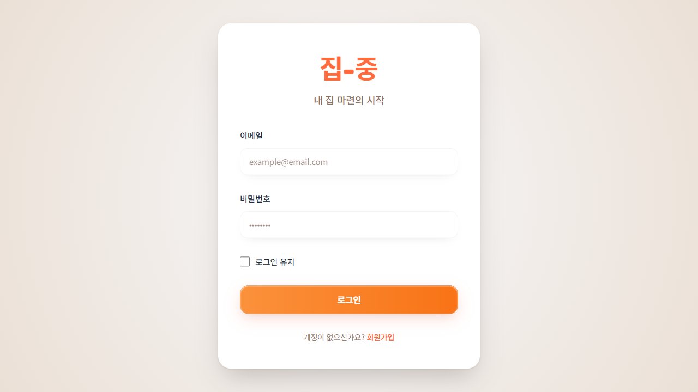
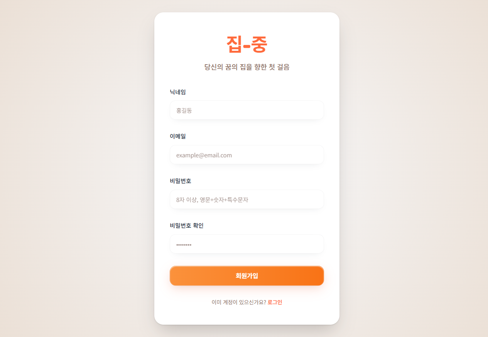
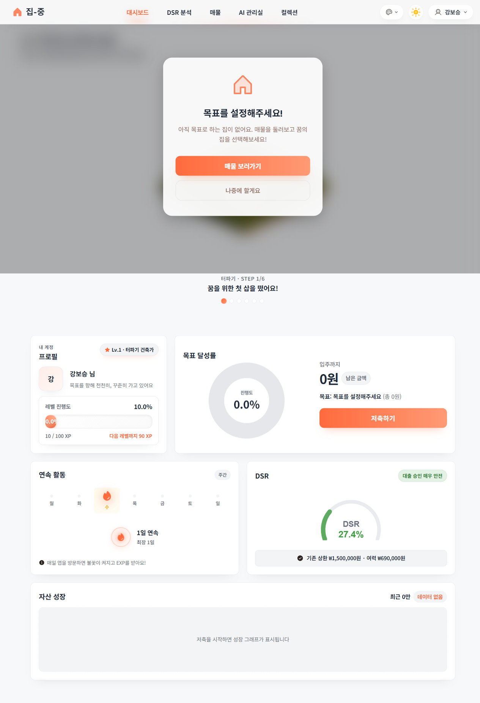
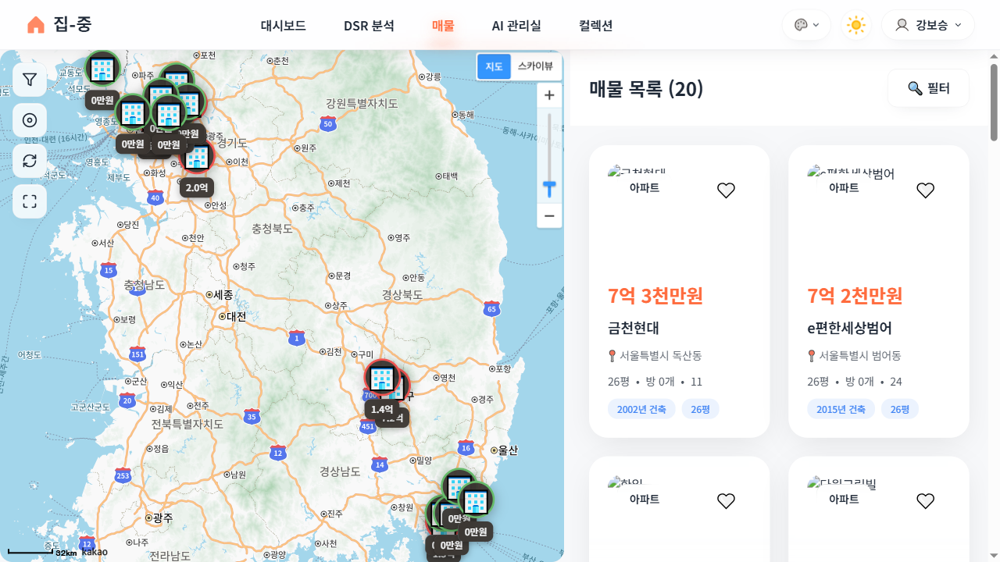
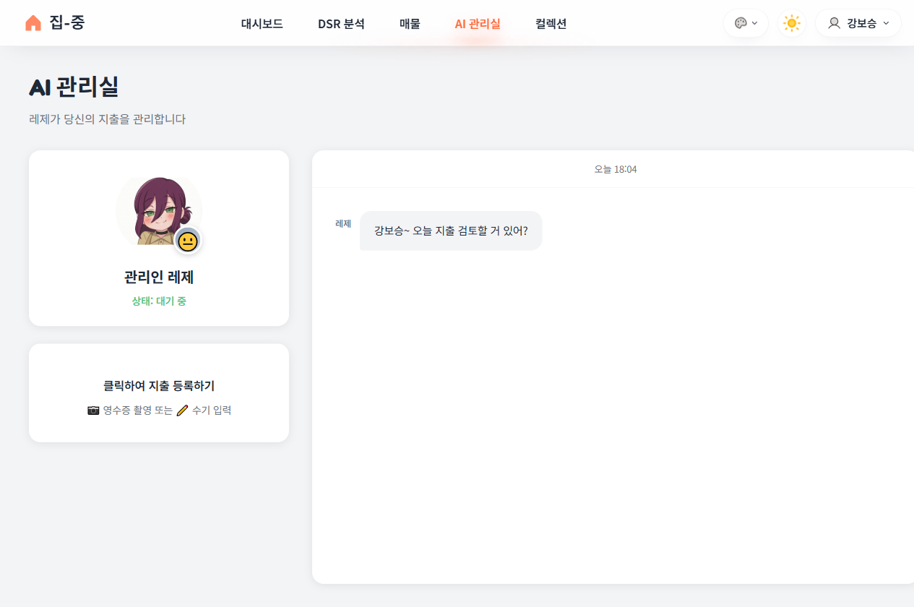
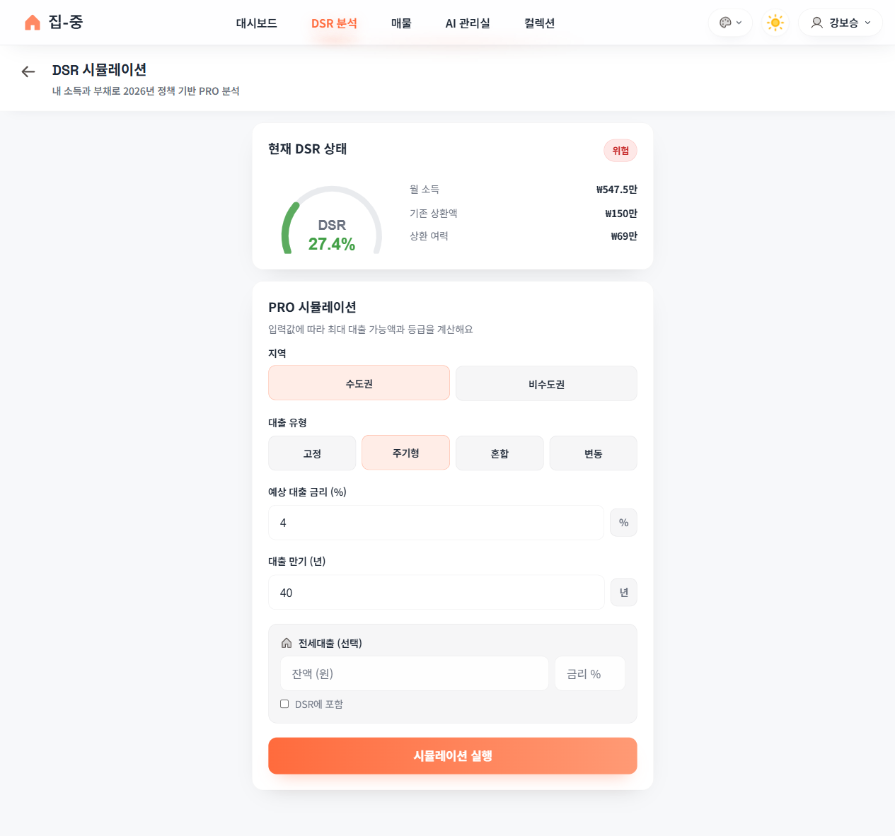
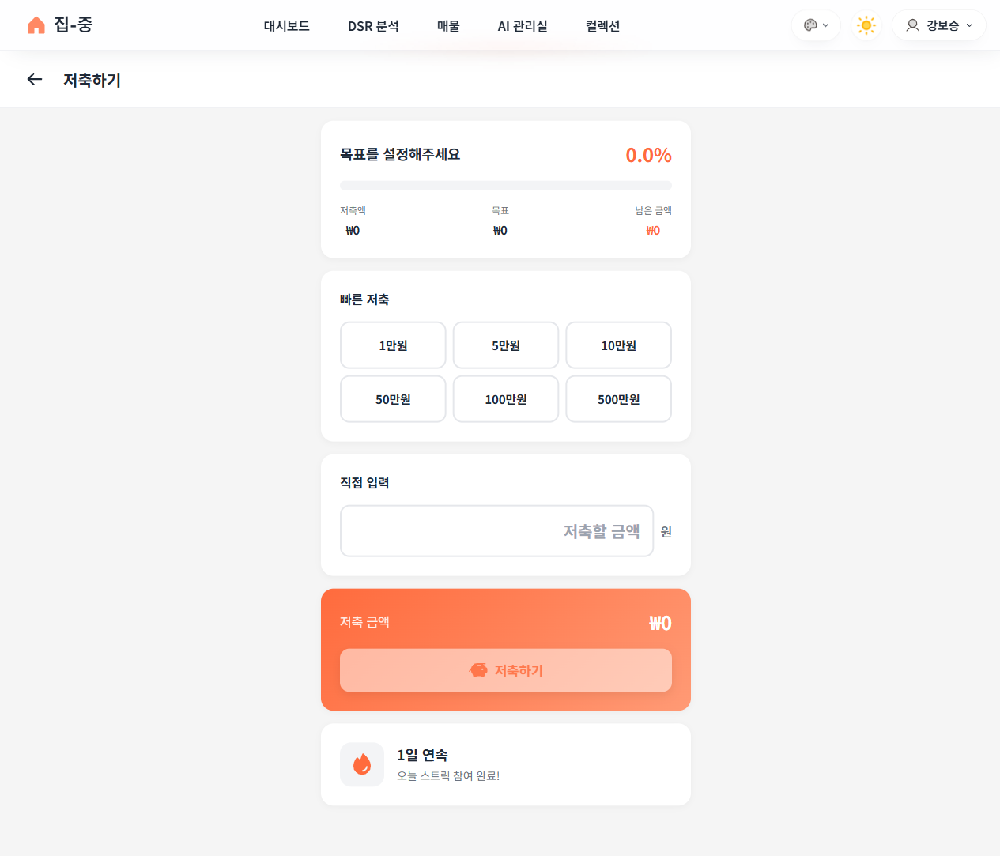
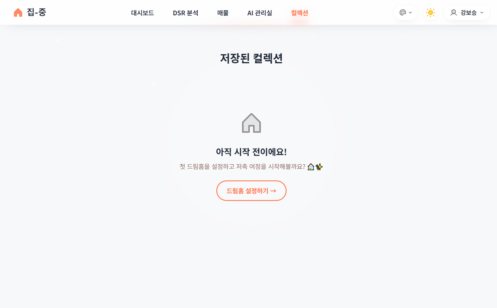
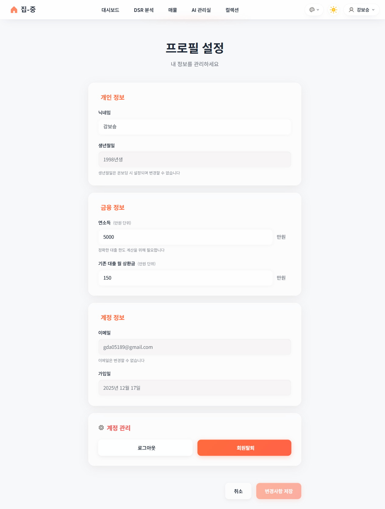

# 집-중 (JipJung) 화면 리뷰 문서

> **작성일**: 2024-12-17
> **목적**: 사용자 관점 및 기획 의도에서 각 화면 리뷰

---

## 📱 화면 목록

| # | 화면명 | 경로 | 스크린샷 |
|---|--------|------|----------|
| 1 | 로그인 | `/login` | 01-login.png |
| 2 | 회원가입 | `/register` | 02-register.png |
| 3 | 대시보드 | `/` | 04-dashboard.png |
| 4 | 매물 검색 | `/properties` | 05-properties.png |
| 5 | AI 관리실 | `/ai-manager` | 06-ai-manager.png |
| 6 | DSR 시뮬레이션 | `/dsr-simulation` | 07-dsr-simulation.png |
| 7 | 저축하기 | `/savings` | 08-savings.png |
| 8 | 컬렉션 | `/collection` | 09-collection.png |
| 9 | 프로필 설정 | `/profile` | 10-profile.png |

---

## 1. 로그인 페이지 (`/login`)



### 기획 의도
- 첫 진입점으로 브랜드 아이덴티티 전달
- "내 집 마련의 시작"이라는 슬로건으로 서비스 목적 명확화

### UI 구성
- **로고**: "집-중" 주황색 로고
- **슬로건**: "내 집 마련의 시작"
- **폼 필드**: 이메일, 비밀번호
- **옵션**: 로그인 유지 체크박스
- **CTA**: 주황색 로그인 버튼
- **링크**: 회원가입 안내

### 사용자 경험 분석
| 항목 | 평가 | 비고 |
|------|------|------|
| 시각적 명확성 | ✅ 좋음 | 깔끔한 카드 디자인, 충분한 여백 |
| 브랜드 일관성 | ✅ 좋음 | 주황색 테마 일관 적용 |
| 폼 사용성 | ✅ 좋음 | 플레이스홀더로 입력 안내 |
| 접근성 | ⚠️ 확인 필요 | 비밀번호 표시/숨김 토글 없음 |

### 개선 제안
- [ ] 비밀번호 보기/숨기기 토글 추가
- [ ] 소셜 로그인 옵션 (추후 고려)

---

## 2. 회원가입 페이지 (`/register`)



### 기획 의도
- "당신의 꿈의 집을 향한 첫 걸음" - 감성적 접근
- 필수 정보만 수집하여 진입 장벽 최소화

### UI 구성
- **로고**: "집-중"
- **슬로건**: "당신의 꿈의 집을 향한 첫 걸음"
- **폼 필드**: 닉네임, 이메일, 비밀번호, 비밀번호 확인
- **비밀번호 규칙**: "8자 이상, 영문+숫자+특수문자"
- **CTA**: 회원가입 버튼
- **링크**: 로그인 페이지

### 사용자 경험 분석
| 항목 | 평가 | 비고 |
|------|------|------|
| 폼 복잡도 | ✅ 적절 | 4개 필드로 최소화 |
| 유효성 안내 | ✅ 좋음 | 비밀번호 규칙 명시 |
| 에러 피드백 | ⚠️ 확인 필요 | 실시간 유효성 검사 여부 |

### 개선 제안
- [ ] 비밀번호 강도 표시기 추가
- [ ] 실시간 유효성 검사 피드백

---

## 3. 대시보드 (`/`)



### 기획 의도
- **핵심 허브**: 모든 정보를 한눈에 파악
- **게이미피케이션**: 집 성장, 레벨, 경험치로 동기부여
- **목표 시각화**: 저축 진행률, DSR 상태 표시

### UI 구성 (Bento Grid)

#### 상단 영역
- **드림홈 설정 모달**: 목표 미설정 시 CTA
- **집 성장 시각화**: "터파기 · STEP 1/6", "꿈을 위한 첫 삽을 떴어요!"

#### 프로필 카드
- 닉네임: "강보승 님"
- 레벨: "Lv.1 · 터파기 건축가"
- 레벨 진행도: 10/100 XP (10.0%)

#### 목표 달성률
- 진행도 도넛 차트: 0.0%
- 입주까지 남은 금액: ₩0
- CTA: "저축하기" 버튼

#### 연속 활동 (스트릭)
- 주간 캘린더 표시
- "1일 연속", 최장 1일
- 동기부여 메시지

#### DSR 카드
- DSR 게이지: 27.4%
- 상태: "대출 승인 매우 안전"
- 기존 상환 ₩1,500,000 · 여력 ₩690,000원

#### 자산 성장 차트
- "저축을 시작하면 성장 그래프가 표시됩니다"

### 사용자 경험 분석
| 항목 | 평가 | 비고 |
|------|------|------|
| 정보 밀도 | ✅ 적절 | Bento 그리드로 구조화 |
| 게이미피케이션 | ✅ 훌륭 | 레벨, XP, 스트릭으로 동기부여 |
| CTA 명확성 | ✅ 좋음 | "매물 보러가기", "저축하기" 버튼 눈에 띔 |
| 신규 사용자 안내 | ✅ 좋음 | 목표 설정 모달로 온보딩 유도 |

### 개선 제안
- [ ] 스트릭 보상 시스템 강조 (마일스톤 배지)
- [ ] 빈 차트 상태에서 예시 데이터 표시 옵션

---

## 4. 매물 검색 (`/properties`)



### 기획 의도
- 카카오맵 기반 직관적인 매물 탐색
- 지도 + 리스트 하이브리드 뷰

### UI 구성

#### 지도 영역 (좌측)
- 카카오맵 전국 뷰
- 가격 마커 (예: "0억원", "2.0억", "1.4억")
- 줌/현위치 컨트롤

#### 리스트 영역 (우측)
- **헤더**: "매물 목록 (20)" + 필터
- **매물 카드**:
  - 아파트명
  - 가격 (예: "7억 3천만원")
  - 위치
  - 평수, 방 개수
  - 건축년도
  - 찜하기 버튼

### 사용자 경험 분석
| 항목 | 평가 | 비고 |
|------|------|------|
| 지도 UX | ✅ 좋음 | 클러스터링, 가격 마커 직관적 |
| 리스트 정보량 | ✅ 적절 | 핵심 정보만 표시 |
| 반응형 | ⚠️ 확인 필요 | 모바일에서 지도/리스트 토글 |

### 개선 제안
- [ ] 필터 옵션 확장 (가격대, 평수, 연식)
- [ ] 최근 본 매물 히스토리

---

## 5. AI 관리실 (`/ai-manager`)



### 기획 의도
- **캐릭터 기반**: "레제" 캐릭터로 친근한 AI 경험
- **지출 심문**: AI가 지출을 분석하고 피드백

### UI 구성

#### 캐릭터 영역
- 레제 아바타
- "관리인 레제"
- 상태: "대기 중"

#### 지출 등록
- "클릭하여 지출 등록하기"
- 영수증 촬영 또는 수기 입력

#### 채팅 영역
- 시간 표시: "오늘 18:04"
- AI 메시지: "강보승~ 오늘 지출 검토할 거 있어?"

### 사용자 경험 분석
| 항목 | 평가 | 비고 |
|------|------|------|
| 캐릭터 디자인 | ✅ 훌륭 | 친근한 애니메이션 스타일 |
| 인터랙션 안내 | ✅ 좋음 | 명확한 CTA |
| 대화형 UX | ✅ 좋음 | 채팅 인터페이스 친숙함 |

### 개선 제안
- [ ] 지출 히스토리 탭 추가
- [ ] AI 판결 결과 시각화 강화

---

## 6. DSR 시뮬레이션 (`/dsr-simulation`)



### 기획 의도
- 2026년 DSR 정책 기반 대출 한도 계산
- LITE(자동) / PRO(상세) 모드 제공

### UI 구성

#### 현재 DSR 상태
- 게이지: 27.4%
- 상태 뱃지: "위험" (빨간색)
- 월 소득: ₩547.5만
- 기존 상환액: ₩150만
- 상환 여력: ₩69만

#### PRO 시뮬레이션 폼
- **지역**: 수도권 / 비수도권 토글
- **대출 유형**: 고정, 주기형, 혼합, 변동
- **예상 대출 금리**: 4%
- **대출 만기**: 40년
- **전세대출 (선택)**: 잔액, 금리
- **CTA**: "시뮬레이션 실행"

### 사용자 경험 분석
| 항목 | 평가 | 비고 |
|------|------|------|
| 정보 구조 | ✅ 좋음 | 현재 상태 + 시뮬레이션 분리 |
| 입력 폼 | ✅ 직관적 | 토글/버튼 선택 방식 |
| 결과 시각화 | ✅ 좋음 | 게이지 + 숫자 병행 |

### 개선 제안
- [ ] 시뮬레이션 결과 비교 기능
- [ ] 대출 상품 추천 연동

---

## 7. 저축하기 (`/savings`)



### 기획 의도
- 간편한 저축 기록
- 게이미피케이션 연동 (스트릭, XP)

### UI 구성

#### 목표 상태
- "목표를 설정해주세요"
- 진행률: 0.0%
- 저축액 / 목표 / 남은 금액: ₩0

#### 빠른 저축
- 프리셋 버튼: 1만원, 5만원, 10만원, 50만원, 100만원, 500만원

#### 직접 입력
- 금액 입력 필드

#### 저축 실행
- 주황색 "저축하기" 버튼
- 저축 금액: ₩0

#### 스트릭 표시
- "1일 연속"
- "오늘 스트릭 참여 완료!"

### 사용자 경험 분석
| 항목 | 평가 | 비고 |
|------|------|------|
| 입력 편의성 | ✅ 훌륭 | 프리셋 + 직접입력 병행 |
| 피드백 | ✅ 좋음 | 스트릭 참여 즉시 확인 |
| 동기부여 | ✅ 좋음 | 연속 저축 강조 |

### 개선 제안
- [ ] 저축 메모 기능
- [ ] 자동 이체 연동 (추후)

---

## 8. 컬렉션 (`/collection`)



### 기획 의도
- 완료한 드림홈 기록 보관
- 성취감 + 추억 저장소

### UI 구성 (빈 상태)
- **제목**: "저장된 컬렉션"
- **빈 상태 아이콘**: 집 아이콘
- **메시지**: "아직 시작 전이에요!"
- **안내**: "첫 드림홈을 설정하고 저축 여정을 시작해볼까요?"
- **CTA**: "드림홈 설정하기 →"

### 사용자 경험 분석
| 항목 | 평가 | 비고 |
|------|------|------|
| 빈 상태 UX | ✅ 훌륭 | 친근한 안내 + 명확한 CTA |
| 온보딩 유도 | ✅ 좋음 | 자연스러운 행동 유도 |

### 개선 제안
- [ ] 컬렉션 있을 때 UI 검토 필요
- [ ] 여정 리플레이 기능 테스트

---

## 9. 프로필 설정 (`/profile`)



### 기획 의도
- 개인정보 관리
- DSR 계산에 필요한 금융 정보 수집

### UI 구성

#### 개인 정보
- 닉네임: 강보승
- 생년월일: 1998년생 (수정 불가 안내)

#### 금융 정보
- 연소득: 5000만원
- 기존 대출 월 상환금: 150만원
- 안내: "정확한 대출 한도 계산을 위해 필요합니다"

#### 계정 정보
- 이메일: gda05189@gmail.com (수정 불가)
- 가입일: 2025년 12월 17일

#### 계정 관리
- 로그아웃 버튼
- 회원탈퇴 버튼 (빨간색)

#### 하단 액션
- 취소 / 변경사항 저장

### 사용자 경험 분석
| 항목 | 평가 | 비고 |
|------|------|------|
| 정보 그룹핑 | ✅ 좋음 | 섹션별 명확한 구분 |
| 수정 가능 여부 | ✅ 명확 | 수정 불가 항목 안내 |
| 위험 액션 | ✅ 좋음 | 탈퇴 버튼 빨간색 강조 |

### 개선 제안
- [ ] 선호 지역 설정 추가
- [ ] 알림 설정 옵션

---

## 🎨 전체 디자인 시스템 평가

### 컬러
| 요소 | 색상 | 용도 |
|------|------|------|
| Primary | 주황색 (#FF6B35 계열) | CTA, 로고, 강조 |
| Success | 초록색 | DSR 안전, 완료 상태 |
| Warning | 노란색 | 주의 |
| Danger | 빨간색 | 위험, 탈퇴 |
| Neutral | 회색 계열 | 배경, 비활성 |

### 타이포그래피
- 한글 가독성 좋음
- 숫자 강조 적절

### 일관성
- ✅ 버튼 스타일 일관
- ✅ 카드 디자인 통일
- ✅ 네비게이션 일관

---

## 📋 종합 개선 우선순위

### 🔴 High Priority
1. 온보딩 플로우 화면 캡처 필요
2. 모달 상태 (드림홈 설정, 저축 완료 등) 캡처

### 🟡 Medium Priority
1. 다크모드 화면 캡처
2. 모바일 반응형 화면 캡처
3. 에러 상태 화면 캡처

### 🟢 Low Priority
1. 로딩 상태 화면
2. 빈 상태 변형들

---

## 📁 스크린샷 파일 위치

```
jipjung-frontend/screenshots/
├── 01-login.png
├── 02-register.png
├── 04-dashboard.png
├── 05-properties.png
├── 06-ai-manager.png
├── 07-dsr-simulation.png
├── 08-savings.png
├── 09-collection.png
└── 10-profile.png
```

---

*이 문서는 Playwright를 사용하여 자동 캡처된 스크린샷을 기반으로 작성되었습니다.*
