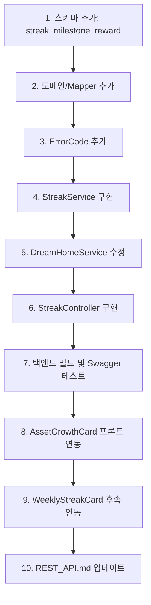

# 스트릭 API & 자산 성장 차트 구현 계획서 (수정본)

## 개요

**목표**: 
1. 저축 시 자동으로 스트릭 참여 처리
2. 7/30/100일 마일스톤 달성 시 보너스 EXP 지급
3. 프론트엔드 차트를 백엔드 데이터와 연동

**결정된 방향**:
- 스트릭 트리거: **자동** (저축 기록 시 자동 참여)
- 보상 방식: **7/30/100일 마일스톤 보너스 EXP**
- `/api/streak/reward`: **마일스톤 보상 수령용**

---

## 현재 상태 분석

### 기존 스키마

```sql
-- streak_history 테이블 (현재)
CREATE TABLE streak_history (
    streak_id BIGINT AUTO_INCREMENT PRIMARY KEY,
    user_id BIGINT NOT NULL,
    streak_date DATE NOT NULL,
    exp_earned INT,
    created_at TIMESTAMP DEFAULT CURRENT_TIMESTAMP,
    UNIQUE KEY uk_user_date (user_id, streak_date)
);

-- user 테이블 스트릭 필드 (현재)
streak_count INT DEFAULT 0,
last_streak_date DATE,
max_streak INT DEFAULT 0
```

### 기존 코드

| 파일 | 현재 상태 | 문제점 |
|-----|---------|--------|
| `DreamHomeService.recordSavings()` | 저축 + EXP + 레벨업 처리 | 스트릭 로직 없음 |
| `StreakHistoryMapper` | 조회만 가능 | `insert` 없음 |
| `WeeklyStreakCard.vue` | `gamificationStore.incrementStreak()` 호출 | 프론트엔드 로컬 상태만 업데이트 |
| `AssetGrowthCard.vue` | 하드코딩된 Mock 데이터 | 백엔드 연동 안됨 |

---

## Part 1: 스키마 변경

### [MODIFY] schema-h2.sql / schema-mysql.sql

> [!IMPORTANT]
> 마일스톤 보상 수령 여부를 추적하기 위한 테이블 추가  
> **중복 수령 정책(초기 버전)**: 사용자당 각 마일스톤은 1회만 수령합니다.  
> `streak_count_at_claim`은 감사/분석용으로만 저장하며 **중복 판단에는 사용하지 않습니다.**  
> 추후 "스트릭 리셋 후 재수령"을 지원하려면 `cycle_id`(또는 `run_started_at`) 컬럼을 추가하고  
> 유니크 키를 `(user_id, milestone_days, cycle_id)`로 확장합니다.

```sql
-- 스트릭 마일스톤 보상 기록 테이블 (신규)
CREATE TABLE streak_milestone_reward (
    reward_id BIGINT AUTO_INCREMENT PRIMARY KEY,
    user_id BIGINT NOT NULL,
    milestone_days INT NOT NULL COMMENT '마일스톤 일수 (7, 30, 100)',
    exp_reward INT NOT NULL COMMENT '지급된 경험치',
    claimed_at TIMESTAMP DEFAULT CURRENT_TIMESTAMP,
    streak_count_at_claim INT NOT NULL COMMENT '수령 시점의 연속일수',
    
    UNIQUE KEY uk_user_milestone (user_id, milestone_days),
    FOREIGN KEY (user_id) REFERENCES `user`(user_id) ON DELETE CASCADE
);
```

**마일스톤 보상 정책:**

| 마일스톤 | 보너스 EXP | 비고 |
|---------|-----------|------|
| 7일 연속 | +100 EXP | 일주일 |
| 30일 연속 | +300 EXP | 한 달 |
| 100일 연속 | +1000 EXP | 100일 |

---

## Part 2: 백엔드 구현

### 2.1 도메인 추가

#### [NEW] StreakMilestoneReward.java

```java
package com.jipjung.project.domain;

@Getter
@NoArgsConstructor
@AllArgsConstructor
@Builder
public class StreakMilestoneReward {
    private Long rewardId;
    private Long userId;
    private Integer milestoneDays;       // 7, 30, 100
    private Integer expReward;
    private LocalDateTime claimedAt;
    private Integer streakCountAtClaim;  // 수령 시점 연속일수
}
```

---

### 2.2 Mapper 수정

#### [MODIFY] [StreakHistoryMapper.java](file:///c:/Users/gds05/OneDrive/바탕%20화면/jipjung/jipjung-backend/src/main/java/com/jipjung/project/repository/StreakHistoryMapper.java)

```java
/**
 * 스트릭 기록 삽입
 */
int insert(StreakHistory streakHistory);
```

#### [MODIFY] [StreakHistoryMapper.xml](file:///c:/Users/gds05/OneDrive/바탕%20화면/jipjung/jipjung-backend/src/main/resources/mapper/StreakHistoryMapper.xml)

```xml
<!-- 스트릭 기록 삽입 -->
<insert id="insert" useGeneratedKeys="true" keyProperty="streakId">
    INSERT INTO streak_history (user_id, streak_date, exp_earned)
    VALUES (#{userId}, #{streakDate}, #{expEarned})
</insert>
```

#### [NEW] StreakMilestoneRewardMapper.java

```java
@Mapper
public interface StreakMilestoneRewardMapper {
    
    /**
     * 마일스톤 보상 수령 여부 확인
     * 사용자당 마일스톤 1회 수령 기준
     */
    boolean existsByUserAndMilestone(
        @Param("userId") Long userId,
        @Param("milestoneDays") int milestoneDays
    );
    
    /**
     * 보상 기록 삽입
     */
    int insert(StreakMilestoneReward reward);
    
    /**
     * (선택) DB 기반 수령 가능 마일스톤 목록 조회
     * 초기 버전에서는 서비스에서 MILESTONE_REWARDS + exists 체크로 계산
     */
    List<Integer> findClaimableMilestones(
        @Param("userId") Long userId,
        @Param("currentStreak") int currentStreak
    );
}
```

#### [MODIFY] [UserMapper.java](file:///c:/Users/gds05/OneDrive/바탕%20화면/jipjung/jipjung-backend/src/main/java/com/jipjung/project/repository/UserMapper.java)

```java
/**
 * 스트릭 정보 업데이트
 */
@Update("""
    UPDATE `user`
    SET streak_count = #{streakCount},
        max_streak = #{maxStreak},
        last_streak_date = #{lastStreakDate}
    WHERE user_id = #{userId}
""")
int updateStreak(
    @Param("userId") Long userId,
    @Param("streakCount") int streakCount,
    @Param("maxStreak") int maxStreak,
    @Param("lastStreakDate") LocalDate lastStreakDate
);
```

---

### 2.3 ErrorCode 추가

#### [MODIFY] [ErrorCode.java](file:///c:/Users/gds05/OneDrive/바탕%20화면/jipjung/jipjung-backend/src/main/java/com/jipjung/project/global/exception/ErrorCode.java)

```java
// 스트릭 관련
STREAK_ALREADY_PARTICIPATED(400, "오늘 이미 스트릭에 참여했습니다"),
STREAK_REWARD_NOT_ELIGIBLE(400, "보상 수령 조건을 충족하지 않습니다"),
STREAK_REWARD_ALREADY_CLAIMED(400, "이미 수령한 마일스톤 보상입니다"),
```

---

### 2.4 서비스 구현

#### [NEW] StreakService.java

```java
@Slf4j
@Service
@RequiredArgsConstructor
public class StreakService {

    private static final ZoneId ZONE_KST = ZoneId.of("Asia/Seoul");
    private static final int DAILY_STREAK_EXP = 50;
    private static final Map<Integer, Integer> MILESTONE_REWARDS = Map.of(
        7, 100,
        30, 300,
        100, 1000
    );

    private final StreakHistoryMapper streakHistoryMapper;
    private final StreakMilestoneRewardMapper milestoneRewardMapper;
    private final UserMapper userMapper;
    private final GrowthLevelMapper growthLevelMapper;
    private final Clock clock; // KST 기준 (기본: Clock.system(ZONE_KST))

    /**
     * 스트릭 참여 처리 (저축 API 내부에서 호출)
     * 
     * @return 획득한 경험치 (이미 참여한 경우 0)
     */
    @Transactional
    public StreakResult participate(Long userId) {
        LocalDate today = LocalDate.now(clock);
        
        // 1. 오늘 이미 참여했으면 스킵 (에러 아님, 0 반환)
        if (streakHistoryMapper.existsByUserIdAndDate(userId, today)) {
            log.debug("User {} already participated today", userId);
            return StreakResult.alreadyParticipated();
        }

        User user = userMapper.findById(userId);
        
        // 2. 연속 저축 여부 판단
        int newStreakCount = calculateNewStreakCount(user, today);
        int newMaxStreak = Math.max(newStreakCount, nullToZero(user.getMaxStreak()));

        // 3. streak_history INSERT
        StreakHistory history = StreakHistory.builder()
                .userId(userId)
                .streakDate(today)
                .expEarned(DAILY_STREAK_EXP)
                .build();
        streakHistoryMapper.insert(history);

        // 4. User 테이블 UPDATE
        userMapper.updateStreak(userId, newStreakCount, newMaxStreak, today);
        
        // 5. 경험치 적용 + 레벨업 체크
        userMapper.addExp(userId, DAILY_STREAK_EXP);
        User updatedUser = userMapper.findById(userId);
        boolean isLevelUp = checkAndApplyLevelUp(userId, user, updatedUser);

        log.info("Streak participated. userId: {}, streak: {}, exp: +{}", 
                userId, newStreakCount, DAILY_STREAK_EXP);

        return new StreakResult(
            newStreakCount, 
            newMaxStreak, 
            DAILY_STREAK_EXP, 
            isLevelUp,
            false // alreadyParticipated
        );
    }

    /**
     * 마일스톤 보상 수령
     */
    @Transactional
    public MilestoneRewardResult claimMilestoneReward(Long userId, int milestoneDays) {
        // 1. 유효한 마일스톤인지 확인
        if (!MILESTONE_REWARDS.containsKey(milestoneDays)) {
            throw new BusinessException(ErrorCode.STREAK_REWARD_NOT_ELIGIBLE);
        }

        User user = userMapper.findById(userId);
        int currentStreak = nullToZero(user.getStreakCount());

        // 2. 스트릭이 마일스톤 이상인지 확인
        if (currentStreak < milestoneDays) {
            throw new BusinessException(ErrorCode.STREAK_REWARD_NOT_ELIGIBLE);
        }

        // 3. 이미 수령했는지 확인 (사용자당 1회)
        if (milestoneRewardMapper.existsByUserAndMilestone(userId, milestoneDays)) {
            throw new BusinessException(ErrorCode.STREAK_REWARD_ALREADY_CLAIMED);
        }

        // 4. 보상 지급
        int expReward = MILESTONE_REWARDS.get(milestoneDays);
        StreakMilestoneReward reward = StreakMilestoneReward.builder()
                .userId(userId)
                .milestoneDays(milestoneDays)
                .expReward(expReward)
                .streakCountAtClaim(currentStreak)
                .build();
        milestoneRewardMapper.insert(reward);

        // 5. 경험치 적용
        userMapper.addExp(userId, expReward);
        User updatedUser = userMapper.findById(userId);
        boolean isLevelUp = checkAndApplyLevelUp(userId, user, updatedUser);

        log.info("Milestone reward claimed. userId: {}, milestone: {}일, exp: +{}", 
                userId, milestoneDays, expReward);

        return new MilestoneRewardResult(milestoneDays, expReward, isLevelUp, currentStreak);
    }

    /**
     * 수령 가능한 마일스톤 목록 조회
     */
    public List<MilestoneInfo> getClaimableMilestones(Long userId) {
        User user = userMapper.findById(userId);
        int currentStreak = nullToZero(user.getStreakCount());

        return MILESTONE_REWARDS.entrySet().stream()
            .filter(e -> currentStreak >= e.getKey())
            .filter(e -> !milestoneRewardMapper.existsByUserAndMilestone(
                    userId, e.getKey()))
            .map(e -> new MilestoneInfo(e.getKey(), e.getValue(), true))
            .toList();
    }

    private int calculateNewStreakCount(User user, LocalDate today) {
        LocalDate lastStreakDate = user.getLastStreakDate();
        
        if (lastStreakDate == null) {
            return 1;
        }
        
        // 어제 참여했으면 연속
        if (lastStreakDate.equals(today.minusDays(1))) {
            return nullToZero(user.getStreakCount()) + 1;
        }
        
        // 그 외 (하루 이상 빠졌으면 리셋)
        return 1;
    }

    private boolean checkAndApplyLevelUp(Long userId, User before, User after) {
        int oldLevel = nullToDefault(before.getCurrentLevel(), 1);
        int newLevel = calculateLevelFromExp(nullToDefault(after.getCurrentExp(), 0));
        
        if (newLevel > oldLevel && newLevel <= 7) {
            userMapper.updateLevel(userId, newLevel);
            return true;
        }
        return false;
    }

    // DreamHomeService와 동일한 레벨 계산 로직 사용
    private static final int[] LEVEL_THRESHOLDS = {0, 100, 300, 600, 1000, 1500, 2100};
    
    private int calculateLevelFromExp(int exp) {
        for (int level = 7; level >= 1; level--) {
            if (exp >= LEVEL_THRESHOLDS[level - 1]) {
                return level;
            }
        }
        return 1;
    }

    private int nullToZero(Integer value) {
        return value != null ? value : 0;
    }

    private int nullToDefault(Integer value, int defaultValue) {
        return value != null ? value : defaultValue;
    }

    // Result Records
    public record StreakResult(
        int currentStreak,
        int maxStreak,
        int expEarned,
        boolean isLevelUp,
        boolean alreadyParticipated
    ) {
        public static StreakResult alreadyParticipated() {
            return new StreakResult(0, 0, 0, false, true);
        }
    }

    public record MilestoneRewardResult(
        int milestoneDays,
        int expReward,
        boolean isLevelUp,
        int streakAtClaim
    ) {}

    public record MilestoneInfo(int days, int expReward, boolean claimable) {}
}
```

---

### 2.5 DreamHomeService 수정

#### [MODIFY] [DreamHomeService.java](file:///c:/Users/gds05/OneDrive/바탕%20화면/jipjung/jipjung-backend/src/main/java/com/jipjung/project/service/DreamHomeService.java)

**변경 위치**: `recordSavings()` 메서드에 스트릭 자동 참여 추가

```diff
+ private final StreakService streakService;

  @Transactional
  public SavingsRecordResponse recordSavings(Long userId, SavingsRecordRequest request) {
      DreamHome dreamHome = findActiveDreamHomeOrThrow(userId);

      saveSavingsHistory(dreamHome.getDreamHomeId(), request);
      long newSavedAmount = updateSavedAmount(dreamHome, request);
      boolean isCompleted = checkAndUpdateCompletion(dreamHome, newSavedAmount, userId);

      ExpLevelResult expResult = processExpAndLevel(userId, request);
      
+     // 입금(DEPOSIT) 시에만 스트릭 자동 참여
+     StreakService.StreakResult streakResult = null;
+     if (request.saveType() == SaveType.DEPOSIT) {
+         streakResult = streakService.participate(userId);
+     }

-     return buildSavingsResponse(dreamHome, newSavedAmount, isCompleted, expResult);
+     return buildSavingsResponse(dreamHome, newSavedAmount, isCompleted, expResult, streakResult);
  }
```

**응답에 스트릭 정보 추가**:

> [!IMPORTANT]
> 현재 `SavingsRecordResponse`는 `dreamHomeStatus`, `growth`만 포함합니다.  
> 아래 변경을 **함께 수행**합니다:
> 1. `SavingsRecordResponse` record 필드에 `StreakInfo streakInfo`(nullable) 추가  
> 2. 기존 `from(...)`는 유지하거나, 새 overload `from(DreamHome, int, User, GrowthLevel, boolean, StreakInfo)` 추가  
> 3. `DreamHomeService`에서 새 시그니처 호출

```java
private SavingsRecordResponse buildSavingsResponse(
        DreamHome dreamHome,
        long newSavedAmount,
        boolean isCompleted,
        ExpLevelResult expResult,
        StreakService.StreakResult streakResult
) {
    // ... 기존 로직 ...
    
    // 스트릭 정보 추가
    StreakInfo streakInfo = null;
    if (streakResult != null && !streakResult.alreadyParticipated()) {
        streakInfo = new StreakInfo(
            streakResult.currentStreak(),
            streakResult.maxStreak(),
            streakResult.expEarned()
        );
    }
    
    return SavingsRecordResponse.from(
        updatedDreamHome,
        expResult.expChange(),
        expResult.user(),
        expResult.growthLevel(),
        expResult.isLevelUp(),
        streakInfo
    );
}
```

---

### 2.6 Controller 구현

#### [NEW] StreakController.java

```java
@Tag(name = "스트릭", description = "마일스톤 보상 수령 API")
@RestController
@RequestMapping("/api/streak")
@RequiredArgsConstructor
public class StreakController {

    private final StreakService streakService;

    /**
     * GET /api/streak/reward
     * 수령 가능한 마일스톤 보상 조회
     */
    @Operation(summary = "수령 가능한 마일스톤 조회")
    @GetMapping("/reward")
    public ResponseEntity<ApiResponse<List<MilestoneInfo>>> getClaimableRewards(
            @AuthenticationPrincipal CustomUserDetails userDetails
    ) {
        List<StreakService.MilestoneInfo> milestones = 
                streakService.getClaimableMilestones(userDetails.getId());
        return ApiResponse.success(milestones);
    }

    /**
     * POST /api/streak/reward
     * 마일스톤 보상 수령
     */
    @Operation(summary = "마일스톤 보상 수령", 
               description = "7/30/100일 연속 저축 마일스톤 보상을 수령합니다")
    @PostMapping("/reward")
    public ResponseEntity<ApiResponse<MilestoneRewardResponse>> claimReward(
            @AuthenticationPrincipal CustomUserDetails userDetails,
            @Valid @RequestBody MilestoneClaimRequest request
    ) {
        StreakService.MilestoneRewardResult result = 
                streakService.claimMilestoneReward(userDetails.getId(), request.milestoneDays());
        
        return ApiResponse.success(MilestoneRewardResponse.from(result));
    }
}
```

---

### 2.7 DTO 추가

```java
// Request
public record MilestoneClaimRequest(
    @NotNull @Schema(description = "마일스톤 일수 (7, 30, 100)")
    Integer milestoneDays
) {}

// Response
public record MilestoneRewardResponse(
    @Schema(description = "마일스톤 일수") int milestoneDays,
    @Schema(description = "획득 경험치") int expReward,
    @Schema(description = "레벨업 여부") boolean isLevelUp,
    @Schema(description = "수령 시점 연속일수") int streakAtClaim,
    @Schema(description = "메시지") String message
) {
    public static MilestoneRewardResponse from(StreakService.MilestoneRewardResult result) {
        String message = switch (result.milestoneDays()) {
            case 7 -> "🔥 7일 연속 저축 달성! 축하합니다!";
            case 30 -> "🌟 30일 연속 저축! 대단해요!";
            case 100 -> "🏆 100일 연속 저축! 당신은 진정한 저축왕!";
            default -> "마일스톤 보상 획득!";
        };
        return new MilestoneRewardResponse(
            result.milestoneDays(), result.expReward(), 
            result.isLevelUp(), result.streakAtClaim(), message
        );
    }
}

// SavingsRecordResponse에 추가할 스트릭 정보
public record StreakInfo(
    @Schema(description = "현재 연속일수") int currentStreak,
    @Schema(description = "최대 연속일수") int maxStreak,
    @Schema(description = "스트릭 획득 경험치") int expEarned
) {}
```

---

## Part 3: 프론트엔드 구현

### 3.1 자산 성장 차트 연동

#### [MODIFY] [AssetGrowthCard.vue](file:///c:/Users/gds05/OneDrive/바탕%20화면/jipjung/jipjung-frontend/src/components/dashboard/bento/AssetGrowthCard.vue)

**변경 전 (라인 27-51)**:
```javascript
const chartLoaded = ref(false)

// Mock data - replace with real data from store
const chartSeries = ref([
  {
    name: '저축액',
    data: [
      { x: new Date('2024-10-01').getTime(), y: 500 },
      // ... 하드코딩
    ]
  }
])
```

**변경 후**:
```javascript
import { useAuthStore } from '@/stores/authStore'
import { storeToRefs } from 'pinia'
import { computed } from 'vue'

const authStore = useAuthStore()
const { user } = storeToRefs(authStore)

const chartLoaded = ref(false)

// 백엔드 데이터 연동 (authStore.user._raw.assets.chartData)
const chartSeries = computed(() => {
  const rawChartData = user.value?._raw?.assets?.chartData || []
  
  if (!rawChartData.length) {
    return [{ name: '저축액', data: [] }]
  }
  
  return [{
    name: '저축액',
    data: rawChartData.map(item => ({
      x: new Date(item.date).getTime(),
      y: Math.round(item.balance / 10000) // 원 → 만원 변환
    }))
  }]
})

const hasChartData = computed(() => {
  return chartSeries.value[0]?.data?.length > 0
})
```

**템플릿 변경**:
```vue
<div class="chart-wrapper">
  <apexchart
    v-if="chartLoaded && hasChartData"
    :key="theme"
    type="area"
    :options="chartOptions"
    :series="chartSeries"
    height="170"
  />
  <div v-else-if="chartLoaded" class="no-data-placeholder">
    <p class="no-data-text">저축을 시작하면 성장 그래프가 표시됩니다</p>
  </div>
</div>
```

**스타일 추가**:
```css
.no-data-placeholder {
  display: flex;
  align-items: center;
  justify-content: center;
  min-height: 170px;
  background: var(--surface-muted, #f9fafb);
  border-radius: 8px;
}

.no-data-text {
  color: var(--bento-text-muted, #6b7280);
  font-size: 0.875rem;
}
```

---

### 3.2 스트릭 카드 연동 (후속 작업)

> [!IMPORTANT]
> 현재 `WeeklyStreakCard.vue`는 로컬 `gamificationStore.incrementStreak()`만 호출합니다.
> 저축 API 호출 시 백엔드에서 자동으로 스트릭이 처리되므로, 프론트엔드는 다음 변경이 필요합니다:

#### [MODIFY] WeeklyStreakCard.vue

**기존 로직 (라인 92-103)**:
```javascript
const handleDayClick = async (day) => {
  if (!day.isToday || day.completed || isSaving.value) return
  isSaving.value = true
  try {
    await gamificationStore.incrementStreak()  // 로컬만 업데이트
    triggerConfetti()
  } catch (error) {
    console.error('오늘 스트릭 체크 실패', error)
  } finally {
    isSaving.value = false
  }
}
```

**개선 방향**:
- 저축 API 응답에서 `streakInfo`를 받아 상태 업데이트
- "오늘 불꽃 켜기" 클릭은 저축 모달 열기로 변경하거나
- 이미 저축했으면 불꽃이 켜진 상태로 표시

```javascript
// 대시보드 데이터에서 스트릭 상태 가져오기
const weekDays = computed(() => {
  // authStore.user._raw.streak.weeklyStatus 데이터 활용
  const weeklyStatus = authStore.user?._raw?.streak?.weeklyStatus || []
  return weeklyStatus.map((status, index) => ({
    label: status.day,
    completed: status.achieved,
    isToday: /* 로직 */
  }))
})
```

---

## Part 4: 레벨/EXP 처리 정책 통일

> [!WARNING]
> 현재 프로젝트 내 레벨/EXP 처리가 서비스마다 다릅니다:
> - `DreamHomeService`: EXP 추가 + 레벨 업데이트까지
> - `AiManagerService`: EXP만 추가, `isLevelUp` 계산만

**통일 방안**: `StreakService`는 `DreamHomeService`와 동일하게 레벨 업데이트까지 처리

추후 리팩토링 시 공용 헬퍼로 분리 권장:
```java
@Service
public class ExpLevelService {
    public ExpLevelResult applyExpAndCheckLevelUp(Long userId, int expToAdd);
}
```

---

## 검증 계획

### 1. 백엔드 빌드 확인

```bash
cd jipjung-backend
./mvnw clean compile
```

### 2. Swagger UI 수동 테스트

**테스트 시나리오 A: 저축 시 스트릭 자동 참여**

1. 로그인하여 JWT 토큰 획득
2. 드림홈 설정 (`POST /api/dream-home`)
3. 저축 기록 (`POST /api/dream-home/savings`)
4. H2 콘솔에서 확인:
   ```sql
   SELECT streak_count, last_streak_date, max_streak FROM user WHERE user_id = ?;
   SELECT * FROM streak_history WHERE user_id = ?;
   ```
5. 예상: streak_count = 1, streak_history에 레코드 생성

**테스트 시나리오 B: 마일스톤 보상 수령**

1. H2 콘솔에서 streak_count를 7로 수동 설정
   ```sql
   UPDATE user SET streak_count = 7 WHERE user_id = ?;
   ```
2. `GET /api/streak/reward` 호출 → 7일 마일스톤 표시 확인
3. `POST /api/streak/reward` (milestoneDays: 7) 호출
4. 예상: 100 EXP 획득, streak_milestone_reward에 레코드 생성
5. 동일 요청 재시도 → `STREAK_REWARD_ALREADY_CLAIMED` 에러 확인

### 3. 프론트엔드 수동 테스트

**자산 성장 차트 테스트**:

1. 신규 사용자로 로그인
2. 대시보드 진입
3. 예상: "저축을 시작하면 성장 그래프가 표시됩니다" 메시지 표시

4. 저축 기록 후 대시보드 새로고침
5. 예상: 차트에 데이터 포인트 표시
6. 그래도 0으로 보이면 DB/JDBC 타임존이 KST인지 확인 (필요하면 JDBC URL에 `serverTimezone=Asia/Seoul` 추가)

---

## 구현 순서



---

## 파일 변경 요약

### 백엔드 (신규)

| 파일 | 설명 |
|-----|------|
| `domain/StreakMilestoneReward.java` | 마일스톤 보상 도메인 |
| `repository/StreakMilestoneRewardMapper.java` | 마일스톤 보상 Mapper |
| `resources/mapper/StreakMilestoneRewardMapper.xml` | MyBatis XML |
| `service/StreakService.java` | 스트릭 서비스 |
| `controller/StreakController.java` | 스트릭 컨트롤러 |
| `controller/dto/request/MilestoneClaimRequest.java` | 요청 DTO |
| `controller/dto/response/MilestoneRewardResponse.java` | 응답 DTO |

### 백엔드 (수정)

| 파일 | 변경 내용 |
|-----|---------|
| `schema-h2.sql` / `schema-mysql.sql` | `streak_milestone_reward` 테이블 추가 |
| `repository/StreakHistoryMapper.java` | `insert` 메서드 추가 |
| `resources/mapper/StreakHistoryMapper.xml` | `<insert>` 쿼리 추가 |
| `repository/UserMapper.java` | `updateStreak` 메서드 추가 |
| `global/exception/ErrorCode.java` | 스트릭 관련 에러 코드 추가 |
| `service/DreamHomeService.java` | 저축 시 스트릭 자동 참여 호출 |
| `controller/dto/response/SavingsRecordResponse.java` | `streakInfo` 필드 추가 |

### 프론트엔드 (수정)

| 파일 | 변경 내용 |
|-----|---------|
| `components/dashboard/bento/AssetGrowthCard.vue` | Mock 데이터 → 백엔드 연동 |
| `components/dashboard/bento/WeeklyStreakCard.vue` | (후속) 백엔드 데이터 연동 |

---

## 예상 소요 시간

| 단계 | 예상 시간 |
|-----|---------|
| Part 1: 스키마 추가 | 10분 |
| Part 2: 백엔드 구현 | 1.5~2시간 |
| Part 3: 프론트엔드 차트 연동 | 30분 |
| Part 3: 프론트엔드 스트릭 연동 (후속) | 30분 |
| 검증 및 테스트 | 30분 |
| **총합** | **약 3~3.5시간** |
