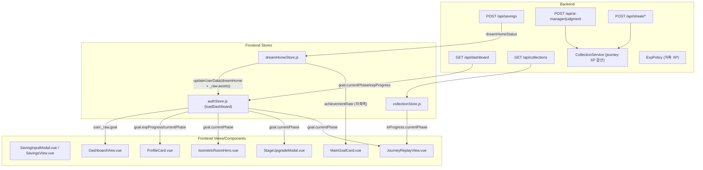

# XP 로직 분석 및 버그 원인 문서

대시보드 XP 관련 버그들의 원인을 분석하고 수정 방향을 정리합니다.

---

## 1. XP 정책 요약

### 1.1 XP 종류 분리 (프로필 레벨 XP vs 여정 XP)

- **프로필 레벨 XP**: `User.currentExp` + `ProfileSection.levelProgress`
  - 획득처: 저축 입금 XP (DreamHomeService), AI 판결 XP (AiManagerService), 스트릭/마일스톤 XP (StreakService)
- **여정 XP (Goal/Collection)**: `CollectionService.loadJourneyEvents(...)`에서 저축/AI/스트릭/마일스톤 이벤트를 합산
  - `goal.expProgress`, `goal.currentPhase`, `/collection/*/journey` 진행 단계에 사용

### 1.2 통일 정책 (확정)

- **단일 소스**: 모든 UI는 `goal.currentPhase` + `goal.expProgress`만 사용
  - 적용 범위: 프로필 레벨 게이지, 집 이미지 변화, 스테이지 축하 알림, 완료 모달
- **경험치 합산 범위**: 저축 + AI + 스트릭(마일스톤 포함)
- **단계 임계값**: `targetExp / 11` 균등 분배 (동적 계산)
- **예외**: "집 성장 진행도" (MainGoalCard 도넛 게이지)는 **저축액 비율만 사용**

### 1.3 백엔드 저축 XP 계산 ([ExpPolicy.java](../../../jipjung-backend/src/main/java/com/jipjung/project/service/ExpPolicy.java))

| 항목 | 값 | 설명 |
|------|-----|------|
| `SAVINGS_EXP_UNIT_AMOUNT` | 10,000원 | XP 1단위 기준 금액 |
| `SAVINGS_EXP_PER_UNIT` | 1 | 1만원당 획득 XP |
| `MAX_EXP_PER_SAVINGS` | 1000 | 1회 저축 시 최대 XP |
| 목표 XP 계산 | `ceil(targetAmount / 10,000)` | 목표 금액 기반 총 XP (올림) |

### 1.4 단계(Phase) 계산 기준

- **총 11단계**: 집 건설 6단계 + 인테리어 5단계
- **계산 방식**: `floor((누적XP * 11) / 목표XP) + 1` (정수 나눗셈)
- **완료 조건**: `goal.expProgress >= 100` 또는 `totalExp >= targetExp`
- **저축만 의존해야 하는 부분**: "집 성장 진행도" (MainGoalCard 도넛 게이지)

---

## 2. 데이터 흐름 다이어그램 (통일 정책 반영)



---

## 3. 버그 원인 분석

### 버그 1: 컬렉션 완성 알림창이 안 뜸

**현재 로직 위치**: [DashboardView.vue](../src/views/DashboardView.vue#L79-97)

```javascript
// line 79-92: completionCandidate
const completionCandidate = computed(() => {
  const goal = authStore.user?._raw?.goal
  if (!goal?.dreamHomeId || goal?.isCompleted !== true) {
    return null  // ← isCompleted가 true가 아니면 null
  }
  // ...
})
```

**🔴 원인**:
1. 완료 모달은 `goal.isCompleted`(DreamHome 상태)만 본다  
   → `goal.expProgress`가 100%여도 모달이 뜨지 않음
2. 프로필 게이지는 `gamificationStore.expProgress`(레벨 진행도)  
   → `goal.expProgress`와 **연동되지 않음**
3. 저축 완료 모달이 `SavingInputModal/SavingsView`에서 이미 뜬 경우,
   `markGoalCompletionShown()`으로 대시보드 모달이 의도적으로 억제됨

**✅ 수정 방향**:
- 완료 조건을 `goal.expProgress >= 100` (또는 `totalExp >= targetExp`)로 통일
- 프로필 게이지도 `goal.expProgress`로 전환
- 저축/AI/스트릭 이후 `goalExpProgress`가 즉시 갱신되도록 응답 보강 또는 대시보드 재조회

---

### 버그 2: 다음 목표 안내가 안 뜸

**현재 로직 위치**: [DashboardView.vue](../src/views/DashboardView.vue#L99-119)

```javascript
function syncGoalGuideVisibility() {
  // ...
  if (hasGoal.value) {
    showGoalGuideModal.value = false  // ← 목표 있으면 안 보여줌
    return
  }
}
```

**🔴 원인**:
- `authStore.js`의 `hasDreamHomeGoal`이 `dreamHomeId != null`이면 `true` 반환
- 완료된 드림홈도 `dreamHomeId`가 남아있어서 여전히 `hasGoal = true`
- **정책 통일 이후 영향**:
  - 완료 기준이 `goal.expProgress >= 100`로 바뀌면,
    `hasDreamHomeGoal`도 이 기준으로 false가 되어야 다음 목표 안내가 뜸
  - 현재는 `goal.isCompleted`만 참고하므로 **완료 상태가 UI에 전달되지 않음**

**✅ 수정 방향**:
- `hasDreamHomeGoal` computed에서 `isCompleted === true`인 경우 `false` 반환하도록 수정
- 또는 `syncGoalGuideVisibility()`에서 `isCompleted` 상태 체크 추가
- **통일 정책 반영 시**:
  - `hasDreamHomeGoal`에서 `goal.expProgress >= 100`(또는 `totalExp >= targetExp`)이면 false 처리
  - 대시보드 모달 조건에서도 동일 기준 사용

---

### 버그 3: 화면 전환 시 게이지 초기화

**현재 로직 위치**: 
- [IsometricRoomHero.vue](../src/components/dashboard/IsometricRoomHero.vue#L208-215)
- [authStore.js loadDashboard()](../src/stores/authStore.js#L558-740)

```javascript
// IsometricRoomHero.vue line 208-215
const goalSnapshot = computed(() => user.value?._raw?.goal || null)
const goalPhase = computed(() => Number(goalSnapshot.value?.currentPhase))
const useGoalPhase = computed(() => {
  if (!goalSnapshot.value?.dreamHomeId) return false
  if (!Number.isFinite(goalTargetExp.value) || goalTargetExp.value <= 0) return false
  return Number.isFinite(goalPhase.value) && goalPhase.value > 0
})
```

**🔴 원인**:
1. `SavingsRecordResponse`에 `goal.currentPhase/totalExp/targetExp`가 없어
   저축 직후에는 `_raw.goal`이 갱신되지 않음 → 단계가 "이전 값"으로 보임
2. `goal.currentPhase`가 null이면 `IsometricRoomHero`가
   `gamificationStore`(6단계)로 폴백 → 11단계와 불일치
3. **정책 통일 이후 영향**:
   - 게이지/집 이미지/스테이지 모달이 모두 `goal.*` 단일 소스가 되므로
     `goalExpProgress` 갱신 지연이 곧 UI 초기화/불일치로 이어짐

**✅ 수정 방향**:
- 저축/AI/스트릭 응답에 `goalExpProgress`(targetExp/totalExp/currentPhase/expProgress) 포함
  또는 저축 후 `authStore.loadDashboard()` 재호출
- 목표가 있는 경우 **gamification 폴백 제거** (goalPhase 유지/재계산)
 - goal data가 갱신되지 않는 구간에서 마지막 유효 `goal.currentPhase` 유지

---

### 버그 4: 컬렉션 진행중 뱃지가 안 바뀜

**현재 로직 위치**: 
- [collectionStore.js](../src/stores/collectionStore.js)
- [CollectionService.java](../../../jipjung-backend/src/main/java/com/jipjung/project/service/CollectionService.java#L471-491)

**🔴 원인**:
1. `collectionStore.fetchCollections()`는 컬렉션 화면 진입 시에만 호출됨
2. 저축/AI/스트릭으로 XP가 변해도 `inProgress`는 갱신되지 않음
3. `inProgress.currentPhase`는 XP 기반 계산이므로 재조회 없이는 갱신 불가
4. **정책 통일 이후 영향**:
   - 컬렉션 진행 뱃지도 `goal.currentPhase`와 동일해야 일관성이 유지됨
   - 현재는 컬렉션 API 결과와 대시보드 goal이 분리되어 있어 단계가 어긋날 수 있음

**✅ 수정 방향**:
- 저축/AI/스트릭 완료 후 `collectionStore.fetchCollections()` 재호출
- 또는 `authStore`의 `goal.currentPhase`를 단일 소스로 공유하여 뱃지 표기 통일

---

### 버그 5: 집 이미지가 제대로 변화 안 됨

**현재 로직 위치**: [IsometricRoomHero.vue](../src/components/dashboard/IsometricRoomHero.vue#L224-243)

```javascript
const activeStage = computed(() => {
  if (useGoalPhase.value) {
    // goalPhase 기반 (XP → Phase)
    const phaseValue = Math.max(1, Math.trunc(goalPhase.value))
    if (phaseValue <= DEFAULT_TOTAL_STEPS) {
      return Math.min(phaseValue, DEFAULT_TOTAL_STEPS)
    }
    return Math.min(DEFAULT_FURNITURE_STEPS, phaseValue - DEFAULT_TOTAL_STEPS)
  }
  // 기존 gamificationStore 기반 (fallback)
  // ...
})
```

**🔴 원인**:
1. `useGoalPhase`가 `false`면 `gamificationStore`(6단계)로 폴백
2. `gamificationStore`는 레벨 XP 기준이라 **여정 11단계와 불일치**
3. `_raw.goal.currentPhase` 갱신 타이밍이 느리면 이미지가 멈춰 보임
4. **정책 통일 이후 영향**:
   - 집 이미지도 `goal.currentPhase` 단일 소스를 따라야 하므로
     gamification 폴백은 제거 대상

**✅ 수정 방향**:
- `goal.currentPhase`를 항상 제공 (대시보드 + 저축/AI/스트릭 응답)
- `goal.currentPhase`가 없으면 `goal.totalExp/goal.targetExp`로 phase 재계산
- 목표가 있는 경우 gamification 폴백 대신 **마지막 유효 phase 유지**
- Phase 6 → 7 전환 시 `ShowroomUnlockModal`로 인테리어 시작 알림

---

## 4. 핵심 수정 포인트 요약

| 우선순위 | 파일 | 수정 내용 |
|---------|------|----------|
| P0 | `ProfileCard.vue` | `goal.expProgress` 기반 게이지로 전환 |
| P0 | `DashboardView.vue` | 완료 모달 기준을 `goal.expProgress >= 100`으로 통일 |
| P0 | `authStore.js` | `hasDreamHomeGoal`에서 `isCompleted` 상태 고려 |
| P1 | `SavingsRecordResponse` + 관련 서비스 | 저축/AI/스트릭 응답에 `goalExpProgress` 추가 또는 대시보드 재조회 |
| P1 | `IsometricRoomHero.vue` | `goalPhase` 기반으로만 렌더링 (6단계 폴백 제거) |
| P1 | `StageUpgradeModal.vue` | `goal.currentPhase` 변화 감지로 축하 모달 트리거 |
| P1 | `ShowroomUnlockModal.vue` | Phase 6 → 7 전환 시 인테리어 시작 알림 |
| P1 | `gamificationStore.js` | UI 의존 제거 (고정 LEVEL_THRESHOLDS 사용 경로 정리) |
| P2 | `collectionStore.js` | XP 변화 후 `fetchCollections()` 재호출 or goalPhase 공유 |

---

## 5. "집 성장 진행도"는 저축액에만 의존해야 함

**현재 문제**: AI XP, 스트릭 XP가 포함된 총 XP로 진행도 계산 중

**요구사항**: MainGoalCard의 도넛 게이지는 **저축액 비율**만 표시

**현재 코드**: [MainGoalCard.vue](../src/components/dashboard/bento/MainGoalCard.vue#L196-204)
```javascript
const progressPercent = computed(() => {
  if (expProgress.value != null) {  // ← XP 기반 진행도
    const value = Number(expProgress.value)
    if (Number.isFinite(value)) {
      return Math.min(100, Math.max(0, value))
    }
  }
  return achievementRateNumber.value  // ← 저축액 비율 (fallback)
})
```

**✅ 수정 방향**:
- `MainGoalCard`에서 `progressPercent`를 `achievementRateNumber`만 사용하도록 변경
- `goal.expProgress`는 **여정 XP(저축+AI+스트릭)** 이므로 집 성장 게이지에서 제외

---

## 6. 검증 계획

### 수동 테스트
1. 저축 후 대시보드에서:
   - [ ] 도넛 게이지가 저축액 비율로 표시되는지 확인
   - [ ] 집 이미지가 11단계 중 올바른 단계로 표시되는지 확인
2. 11단계 완료 시:
   - [ ] 완료 모달이 뜨는지 확인 (phase 11과 완료 기준 일치 여부 확인)
   - [ ] 모달 닫은 후 "다음 목표 안내" 모달이 뜨는지 확인
3. 화면 전환 시:
   - [ ] 다른 페이지 갔다가 대시보드로 돌아와도 게이지가 유지되는지 확인
4. 컬렉션 페이지에서:
   - [ ] 진행중 뱃지가 현재 단계를 반영하는지 확인

---

## 정책 결정 사항

> [!IMPORTANT]
> ### 1. goal.totalExp 범위
> **저축 + AI + 스트릭 전부 포함** (기존 유지)
> - 모든 활동이 집 성장(Phase)에 기여
>
> ### 2. 단일 소스 원칙
> 프로필 게이지, 집 이미지, 스테이지 축하 모달, 완료 모달 모두 `goal.*` 단일 소스 사용
> - `goal.currentPhase` → 집 이미지, 여정 단계
> - `goal.expProgress` → 프로필 게이지, 완료 판정 (`>= 100`)
>
> ### 3. MainGoalCard 도넛 게이지
> **저축액 비율(achievementRate) 유지** - XP 기준 아님
> - 용도: 실제 저축 현황 표시
> - expProgress는 AI/스트릭 포함이라 저축액과 불일치 발생 가능
>
> ### 4. 프로필 레벨 텍스트
> **기존 단계명 유지** (터파기, 기초공사, 골조, ...)

---

## 추가 확인 필요 (정책 결정)

- 목표금액이 먼저 달성되고 XP가 100%에 못 미치는 현상 발생
  - 원인: `ExpPolicy`에서 저축 XP는 1회 최대 500XP cap (대량 입금 시 XP가 목표치보다 늦게 찬다)
  - 관련: `ExpPolicy` 목표XP는 `ceil(targetAmount / 10,000)` 기반이라, 고액 목표일수록 cap 영향이 큼
  - 결정 필요:
    - A) 저축 XP cap 상향/제거
    - B) 여정 XP를 저축액 비율 기반으로 산정 (XP 이벤트 합산 대신)
    - C) 완료 조건을 "저축액 목표 OR XP 100%"로 복원
